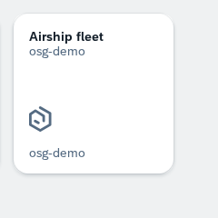
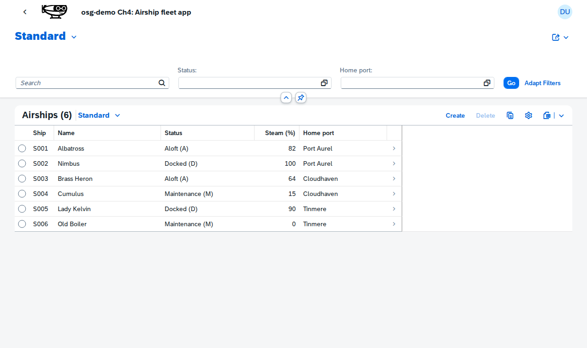
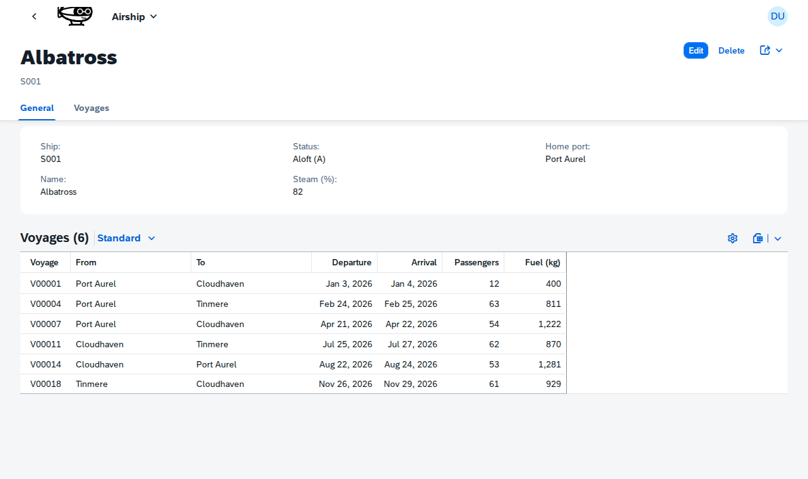

# 4. Fiori apps

The pack's [webapp/](../webapp/) is a Fiori Elements list report and object page over `ZOSD_FLEET_SRV`. It has no controller code: the columns, filters and facets come from the annotations in the YAML. SAPUI5 loads from ui5.sap.com, so the browser needs to reach it.

1. Open the launchpad (`http://localhost:8099/app/flp.html`) and click the **Airship fleet** tile. Expected: the address ends in `#AirshipFleet-display`, and the list report opens inside the launchpad and shows the six ships with Ship, Name, Status (text first, e.g. `Aloft (A)`), Steam (%) and Home port.

   

   

2. In the filter bar, open the value help of **Status**, pick `Maintenance`, and press **Go**. Expected: Cumulus and Old Boiler. The value help lists the three statuses from `StatusVHSet`.

3. Click **Old Boiler**. Expected: the object page shows its general data and an empty **Voyages** table. Go back and open **Albatross**: its **Voyages** table lists six voyages.

   

4. The tile goes through the launchpad the way a system's does: `#AirshipFleet-display` is the intent the app's [manifest](../webapp/manifest.json) declares in `crossNavigation.inbounds`, and the launchpad opens the component `osd.fleet` from the app's BSP copy, `/sap/bc/ui5_ui5/sap/zosg_demo/`. The same app also runs standalone at `http://localhost:8099/app/osg-demo/`; see [the contract](../docs/fleet-contract.md#app).
