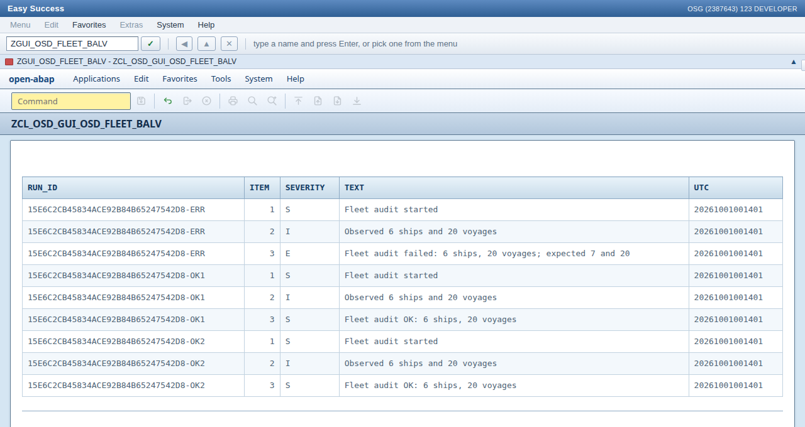

# 8. The business log

The fleet audit counts ships and voyages and says whether they match what is
expected. This chapter keeps that result as SAP's application log (BAL) does:
`CL_BALI_*` writes a log per run under object `ZOSD_FLEET`, subobject `AUDIT`,
with its messages, severities and UTC times, and the log survives a restart.

1. On a seeded system, open [ZCL_OSD_FLEET_BAL](../src/zcl_osd_fleet_bal.clas.abap)
   and press **F9**. It writes two successful audits and one deliberate error,
   commits them, and prints one batch ID and three different log handles.
2. Open [ZCL_OSD_FLEET_BAL_VIEW](../src/zcl_osd_fleet_bal_view.clas.abap) and
   press **F9**. Find the three run IDs ending `OK1`, `OK2` and `ERR`. Each has
   `started`, `Observed 6 ships and 20 voyages`, then a success or error item;
   `ERR` has one error. Restart OSD with the same database file and run the
   viewer again: the same logs and message UTC timestamps remain. `RENDER` also
   accepts an exact run ID, `IV_SEVERITY`, or `IV_ERRORS_ONLY` for filtered reads.
3. See the same messages as a grid: enter `ZGUI_OSD_FLEET_BALV` in
   **WEBGUI** (or open
   `http://localhost:8099/sap/bc/gui/sap/its/webgui/?okcode=ZGUI_OSD_FLEET_BALV`).
   [ZOSD_FLEET_BALV](../src/zosd_fleet_balv.prog.abap) shows one row per message
   with `RUN_ID`, `ITEM`, `SEVERITY`, `TEXT` and `UTC`, sorted by run and
   item; `ZCL_OSD_FLEET_BAL_VIEW=>MESSAGES` supplies the rows. It is a demo
   view of the fleet's log, not SLG1. With no log yet it says
   `No fleet business log to show` (on open-steamgate followed by the BAL
   reason, since its read raises when no log matches).

   

4. Run `ZCL_OSD_FLEET_BAL` in Testing. Its DB-writing ABAP Unit test is
   `DANGEROUS`: it checks the error filter and ordered messages. OSD gives
   SQLite/DuckDB tests a disposable database; for HANA/Postgres, choose a
   dedicated schema/database. Its cleanup on A4H has not been tested.
   `SLICE_SKIP_UI=1 OSD_HOME=/path/to/open-steamgate
   node test/slice.mjs` runs the broader pack check against that runtime.

## Under the hood

One audit becomes one log with three messages, through the standard CL_BALI_* API:

<!-- code: src/zcl_osd_fleet_bal.clas.abap method record -->
```abap
METHOD record.
  DATA(ls_result) = zcl_osd_fleet_audit=>inspect(
    iv_expected_ships = iv_expected_ships
    iv_expected_voyages = iv_expected_voyages ).
  DATA(lo_header) = cl_bali_header_setter=>create(
    object = 'ZOSD_FLEET' subobject = 'AUDIT'
    external_id = iv_run_id ).
  DATA(lo_log) = cl_bali_log=>create_with_header( header = lo_header ).
  lo_log->add_item( item = cl_bali_free_text_setter=>create(
    text = 'Fleet audit started' severity = 'S' ) ).
  lo_log->add_item( item = cl_bali_free_text_setter=>create(
    text = |Observed { ls_result-ship_count } ships and { ls_result-voyage_count } voyages|
    severity = 'I' ) ).
  lo_log->add_item( item = cl_bali_free_text_setter=>create(
    text = ls_result-message severity = ls_result-severity ) ).
  cl_bali_log_db=>get_instance( )->save_log( log = lo_log ).
  rv_handle = lo_log->get_handle( ).
ENDMETHOD.
```
