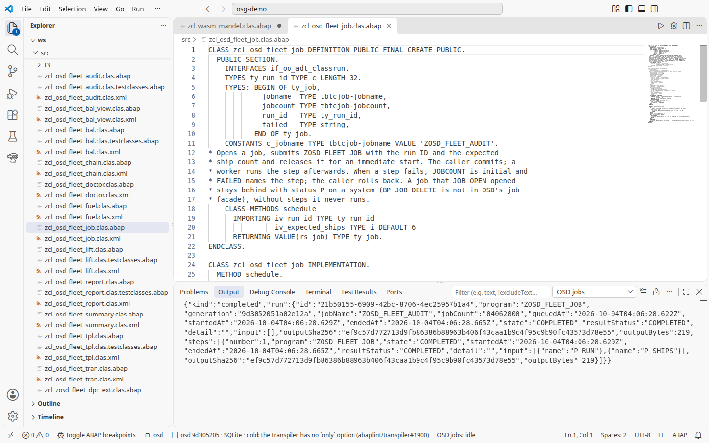

# 9. Background jobs

The audit from chapter 8 now runs in the background, first as one job, then
as a chain of two, and a doctor explains a chain that does not move. The job
and the chain use only the standard job function modules (the doctor uses
open-steamgate's own); nothing runs until a worker picks the job up, the way a
background work process would.

## One job: the audit

The audit also runs as a background job step. This needs SQLite in a file:
other backends refuse to schedule jobs.

With the extension, **osd: Start** also starts the worker on the default
`osd.database.system=sqlite` file database. `osd.jobs.worker=auto` is the
default; `off` disables it. The **OSD jobs** status bar shows the worker's
state. Click it to open the **OSD Jobs** view. For the output summary, run
**OSD: What is running?** and choose **Job worker** to see
a readable summary: one line per job, newest first, with state, start time,
duration and step/output counts; failed runs include a reason. The summary is in the
**OSD: Jobs** output; **Show raw job log** in that picker or the command
palette switches the same channel to the worker JSON, and **Job worker** in **What is running?**
switches it back.
It runs released jobs without a terminal.
The steps below use a checkout and a manually driven worker to show the
queue before and after each step.



1. Start OSD with a file database, for example
   `STG_DB=file STG_DB_PATH=/tmp/fleet.sqlite OSD_PACKS=/path/to/osg-demo npm start`
   in the open-steamgate checkout.
2. Open [ZCL_OSD_FLEET_JOB](../src/zcl_osd_fleet_job.clas.abap) and press **F9**.
   It calls `JOB_OPEN`, submits the report
   [ZOSD_FLEET_JOB](../src/zosd_fleet_job.prog.abap) `VIA JOB` with a fresh run ID
   (`P_RUN`) and the expected ship count (`P_SHIPS`), releases the job with
   `JOB_CLOSE`, and prints `Fleet job ZOSD_FLEET_AUDIT <count> released; run <ID>`.
   Nothing runs yet: the job waits for a worker.
3. For this checkout run, drive the worker yourself. In the same checkout and with
   the same `STG_DB` and `STG_DB_PATH`, but without `OSD_PACKS` (with it, the
   worker reseeds the pack's tables), run
   `node tools/osd-batch-runs.mjs work` (or `worker` to keep it running).
   Expected: JSON with `"kind": "completed"` and a `run` with its own `"id"`
   (a UUID), `"jobName": "ZOSD_FLEET_AUDIT"`, the job count from step 2 and
   `"state": "COMPLETED"`. `node tools/osd-batch-runs.mjs show <that run id>`
   shows the step's output `Fleet audit job <ID>: BAL <handle>`. Another `work`
   answers `"kind": "empty"`; so does a `work` pointed at a wrong
   `STG_DB_PATH`, which quietly starts a fresh database. `"kind": "busy"`
   means a `RUNNING` run blocks the queue until it is interrupted. `worker`
   prints one compact line per worked step.
4. Press **F9** on `ZCL_OSD_FLEET_BAL_VIEW`. Expected: a log for `Run <ID>`
   with `errors 0` and the three audit messages.

The job uses only the standard function modules, so both objects travel to a
system. The job-chain steps from the
[fleet operations trace](../docs/fleet-operations-trace.md) come next.

## A chain of two jobs

Two jobs run as one chain: a readiness job that waits, then a voyage job that
starts it. `ZCL_OSD_FLEET_CHAIN` closes the readiness job first with a named
event, `EVENT_ID = 'ZOSD_FLEET_VOYAGE_DONE'` and the run ID as
`EVENT_PARAM`, and only then releases the voyage job. The voyage step commits
its business log and, only when the count is right, raises that event with
`BP_EVENT_RAISE` as its last action. Because the waiting job exists before the
voyage job can run, a fast voyage job cannot finish first: SAP and
open-steamgate both ignore a raise that comes before the waiting job was
closed. The run ID as event parameter keeps concurrent chains apart. Only
standard function modules are used; no private `TAIL_EVENT_*` extension.
Same setup as above: OSD on `STG_DB=file` and the engine's worker.

1. Open [ZCL_OSD_FLEET_CHAIN](../src/zcl_osd_fleet_chain.clas.abap) and press
   **F9**. It schedules two chains and prints both: `Fleet chain ok: run <A>`
   expects 20 voyages, `Fleet chain forced failure: run <B>` expects 21. Each
   line gives the job counts of the voyage job and of the readiness job, which
   `waits for ZOSD_FLEET_VOYAGE_DONE`.
2. Run `node tools/osd-batch-runs.mjs work` until it answers
   `"kind": "empty"` (four times). Expected, in some order: voyage `A`
   `COMPLETED`, readiness `A` `COMPLETED` (always after voyage `A`), and
   voyage `B` `"kind": "failed"`, `FAILED` (that `work` exits 1).
   `node tools/osd-batch-runs.mjs list` still shows readiness `B` as
   `WAITING`: its event was never raised. Leave it there for the doctor below.
   The facade now supports `BP_JOB_DELETE` for a waiting job; this exercise
   does not call it. For a fresh exercise, use a new database directory.
   See the tag's [job API](https://github.com/oisee/open-steamgate/blob/vscode-v0.6.1650/docs/job-standard-fms.md).
3. Press **F9** on `ZCL_OSD_FLEET_BAL_VIEW`. Expected: `<A>-VOY` with
   `Voyage step OK: 20 voyages`, `<A>-READY` with
   `Fleet ready: 6 ships after a clean voyage step`, and `<B>-VOY` with
   `errors 1` and `Voyage step failed: 20 voyages, expected 21`. The failed
   voyage job commits its log before it aborts, so the error stays readable;
   there is no `<B>-READY`.

What this shows is a scheduling guarantee, not exactly-once execution: a
restart or a replayed import does not start a job twice, but a crash after a
step's business commit and before its result is recorded leaves the job
`RUNNING` for an operator (open-steamgate `docs/job-tail-events.md`). The
event is raised when the voyage step's business work is committed, just
before open-steamgate records the step as finished. So a crash or abort after
a successful raise still starts the readiness job while the voyage job shows
`FAILED` or `RUNNING`; and a raise that fails (on a system: the event is not
defined in SM64, or the job's user may not raise it) aborts the voyage job
after its log already says OK. The portable `BP_EVENT_RAISE` is used on
purpose; open-steamgate's private tail event would tie the event to the
recorded result but does not exist on a system. The chain is measured on
open-steamgate; on a system it follows SAP's documented event pattern but has
not been measured there ([Take it to a system](../docs/take-to-system.md)).

## Why is a chain stuck?

[ZCL_OSD_FLEET_DOCTOR](../src/zcl_osd_fleet_doctor.clas.abap) answers that for
every readiness job that still waits. It selects them with `BP_JOB_SELECT`
(with SAP's `BTCSELECT` fields `PRELIM`, `SCHEDUL`
and so on; a filter the local system cannot honour, such as a date range,
raises `SELECTION_CANCELED` instead of being ignored),
asks open-steamgate's job doctor `ZCL_OSD_JOB_DOCTOR` about the waiting job
and about the voyage job of the same run (found by its `P_RUN`), and adds the
voyage step's BAL log for that run. The job doctor has no link to the business log; the run ID in
the step input (`P_RUN`) is that link.

1. After the chain steps above on a fresh store, press **F9** on the class.
   Expected: `Fleet chains waiting: 1` (one per failing chain you scheduled;
   they stay until the operations store is removed), then
   `Waiting chain <B>: ZOSD_FLEET_READY/... waits for event ZOSD_FLEET_VOYAGE_DONE`, the job doctor's view of the readiness
   job (`OPERATIONS WAITING`, `Wait: event ZOSD_FLEET_VOYAGE_DONE`, `P_RUN=<B>`), of the
   voyage job (`OPERATIONS FAILED result=INCOMPLETE`,
   `REVIEW: failed or interrupted; no automatic replay`, `P_VOYS=21`), and the
   business log `<B>-VOY` with `Voyage step failed: 20 voyages, expected 21`.
   Chain `A` is not listed: nothing of it waits. The voyage job's state
   decides whether a waiting chain is stuck: `FAILED` will not move, while
   `QUEUED` or `RUNNING` (F9 pressed between the chain's steps) is still on
   its way.
2. Job counts, times and handles change with every run; the job doctor also
   says that each read is a separate snapshot, not an atomic report.

The class stays local: `ZCL_OSD_JOB_DOCTOR` is open-steamgate's. On a system,
SM37 and the job log answer the same question.

## Under the hood

The voyage step, a report run as a job: it commits its log, then raises the event only on success:

<!-- code: src/zosd_fleet_voyage.prog.abap -->
```abap
* Job step 1 of the fleet chain (ZCL_OSD_FLEET_CHAIN): counts the voyages and
* records BAL log <run>-VOY. When the count matches, it commits the log and
* then raises ZOSD_FLEET_VOYAGE_DONE with the run ID, which starts the
* readiness job. A count other than P_VOYS commits the log with its error
* and aborts the job without raising the event.
REPORT zosd_fleet_voyage.

PARAMETERS p_run TYPE c LENGTH 32 OBLIGATORY.
PARAMETERS p_voys TYPE i DEFAULT 20.

START-OF-SELECTION.
  DATA lv_ok TYPE abap_bool.
  TRY.
      lv_ok = zcl_osd_fleet_chain=>voyage_step(
        iv_run_id = CONV #( p_run ) iv_expected_voyages = p_voys ).
      COMMIT WORK.
    CATCH cx_bali_runtime INTO DATA(lx_bal).
      MESSAGE lx_bal->get_text( ) TYPE 'A'.
  ENDTRY.
  IF lv_ok = abap_false.
    MESSAGE |Voyage step failed for run { p_run }; see BAL { p_run }-VOY| TYPE 'A'.
  ENDIF.
* the last thing the step does: a raise is not undone by a later ROLLBACK
  CALL FUNCTION 'BP_EVENT_RAISE'
    EXPORTING eventid = zcl_osd_fleet_chain=>c_event eventparm = p_run
    EXCEPTIONS OTHERS = 1.
  IF sy-subrc <> 0.
    MESSAGE |Voyage step { p_run } could not raise { zcl_osd_fleet_chain=>c_event }| TYPE 'A'.
  ENDIF.
  WRITE: / |Voyage step { p_run }: OK|.
```

The readiness job, closed first with the run ID as its event parameter (the voyage job is released after it):

<!-- code: src/zcl_osd_fleet_chain.clas.abap lines 72-97 -->
```abap
CALL FUNCTION 'JOB_OPEN'
  EXPORTING jobname = rs_chain-ready_jobname
  IMPORTING jobcount = rs_chain-ready_count
  EXCEPTIONS OTHERS = 1.
IF sy-subrc <> 0.
  rs_chain-failed = `JOB_OPEN ready`.
  RETURN.
ENDIF.
lv_jobname = rs_chain-ready_jobname.
lv_jobcount = rs_chain-ready_count.
SUBMIT zosd_fleet_ready
  WITH p_run = iv_run_id
  VIA JOB lv_jobname NUMBER lv_jobcount AND RETURN.
IF sy-subrc <> 0.
  rs_chain-failed = `SUBMIT ready`.
  RETURN.
ENDIF.
CALL FUNCTION 'JOB_CLOSE'
  EXPORTING jobname = rs_chain-ready_jobname jobcount = rs_chain-ready_count
            event_id = c_event event_param = lv_event_param
  IMPORTING job_was_released = lv_released
  EXCEPTIONS OTHERS = 1.
IF sy-subrc <> 0 OR lv_released <> 'X'.
  rs_chain-failed = `JOB_CLOSE ready`.
  RETURN.
ENDIF.
```
