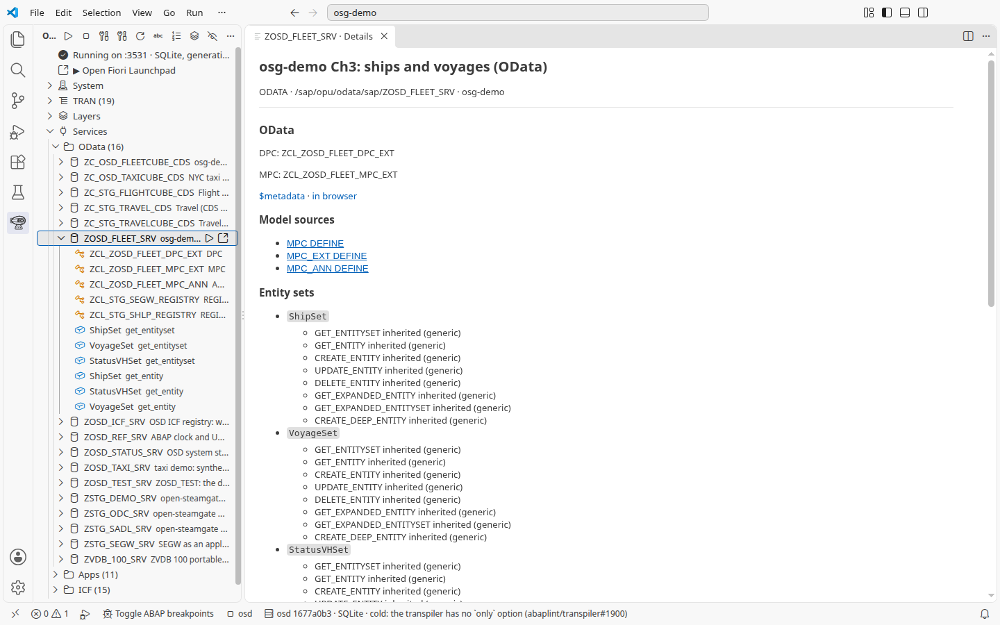
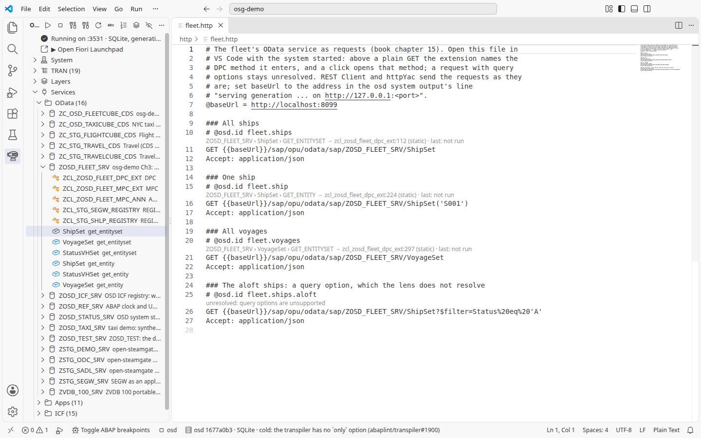
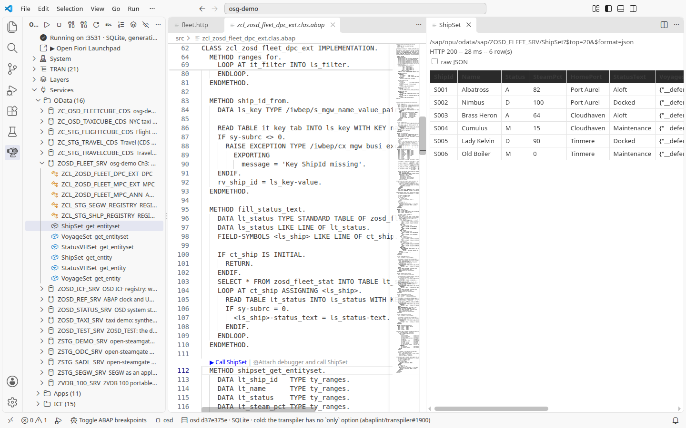
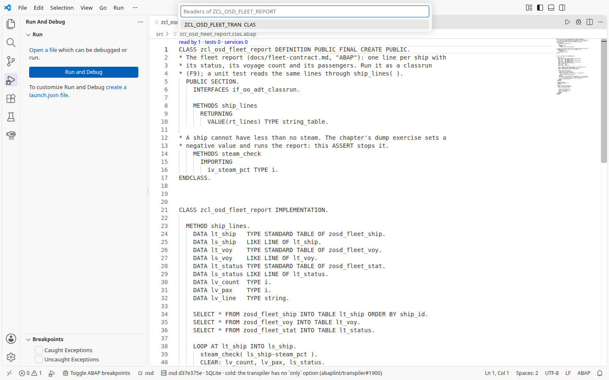

# 15. The workbench: from a service to its code and back

Chapters 1 and 2 used the extension for one object at a time: F9 runs a
class, F8 previews a table, Ctrl+Shift+F10 runs its tests, the debugger stops
in it. This chapter follows the fleet's OData service through VS Code: from the
service to the method that answers it, from a request in a file to the same
method, from the method to the HTTP answer, and from a class to the code that
uses it. The pictures are of the extension 0.4.1444 with the system started
(`osd: Start`, chapter 1).

## From a service to its code

1. Open the OSD view: the airship in the activity bar. Expected: a row
   `Running on …` with the database and the generation, then **Open Fiori
   Launchpad**, **System**, **TRAN**, **Layers** and **Services**.
2. Expand **Services > OData** and then **ZOSD_FLEET_SRV**. Expected: the
   service's classes, `ZCL_ZOSD_FLEET_DPC_EXT` (the data provider, chapter 3),
   the model classes and two registries of the engine, and one row per
   entity-set method: `ShipSet get_entityset`, `VoyageSet get_entityset`,
   `StatusVHSet get_entityset` and the three `get_entity`. A click on the
   service opens its details: the DPC and MPC classes, a `$metadata` link and
   the entity sets. With 0.4.1444 the details call every method "inherited
   (generic)", even those `ZCL_ZOSD_FLEET_DPC_EXT` redefines, such as
   `GET_ENTITYSET` of `ShipSet`; the rows of the tree and the lenses below get
   it right (reported).

   

3. Click **ShipSet get_entityset**. Expected:
   [zcl_zosd_fleet_dpc_ext.clas.abap](../src/zcl_zosd_fleet_dpc_ext.clas.abap)
   opens at `METHOD shipset_get_entityset`, the method that answers
   `GET .../ShipSet`.

## From a request to its code

The repository has the service's requests in one file,
[http/fleet.http](../http/fleet.http), in the `.http` format that REST
Client, httpYac and JetBrains also read.

4. Open `http/fleet.http`. Expected: above each plain `GET` a line names the
   DPC method the request enters, `ZOSD_FLEET_SRV › ShipSet › GET_ENTITYSET →
   zcl_zosd_fleet_dpc_ext:112 (static) · last: not run`; the keyed request goes
   to `GET_ENTITY` at line 224, the voyages to line 297, where the
   redefinition serves a ship's voyages and passes a plain `VoyageSet` on to
   the generated class. The last request has a `$filter` and says
   `unresolved: query options are unsupported`.

   

5. Click the line above the `GET` of **All ships**. Expected: the DPC class
   opens at line 112, `shipset_get_entityset`.

"Static" means the extension worked the method out from the service's model
and the class's code; it did not watch a request reach it, and it names the
method a request enters, not every method that then runs. The lens resolves a
plain `GET` of a set or of one entity. Anything else it leaves "unresolved"
rather than guess, even where the answer is simple: the `$filter` request
enters `shipset_get_entityset` too, which reads the filter into ranges. With
`$expand`, writes and `$batch`, other or more methods run.

## From the code to the HTTP answer

6. In a fresh VS Code window with the system started, open
   `ZCL_ZOSD_FLEET_DPC_EXT`, set a breakpoint on the first statement of
   `shipset_get_entityset`, `lt_ship_id = ranges_for(` (a `DATA` line never
   stops), and wait until its dot is filled. Then click **Attach debugger and
   call ShipSet** above the method. Expected, with 0.4.1444 in a fresh window:
   the request stops on the breakpoint. Stop the session (Shift+F5) and remove
   the breakpoint. After a plain call (step 7) or in a longer session it did
   not stop in our runs, even with a filled dot (reported). With 0.4.1414 the
   breakpoint stayed hollow.
7. Above the same method, click **▶ Call ShipSet**. Expected: beside the code,
   the request it sent,
   `/sap/opu/odata/sap/ZOSD_FLEET_SRV/ShipSet?$top=20&$format=json`, then
   `HTTP 200`, the time and `6 row(s)`, and the six ships as a table with
   `StatusText` filled by the method. **raw JSON** shows the answer as it came.

   

## Who uses this class

8. Open [ZCL_OSD_FLEET_REPORT](../src/zcl_osd_fleet_report.clas.abap).
   Expected: above `CLASS zcl_osd_fleet_report DEFINITION`, the line `read by
   1 · tests 0 · services 0`. Click it. Expected: a list of the code that uses
   the class, here `ZCL_OSD_FLEET_TRAN` (the transaction of chapter 2); a
   choice opens it. The class's own test class sits in the class's own
   include and is not listed.

   

## Send the requests yourself

`http/fleet.http` is an ordinary `.http` file. With REST Client or httpYac,
set `@baseUrl` to the address the system serves on: the **osd system** output
says it in its line `serving generation … on http://127.0.0.1:<port>`. The
`# @osd.id` lines are ignored by those clients. They name each request as a
case for open-steamgate's regression tools, which read the same file; turning
the cases saved in the SAP Gateway Client into such files is on
open-steamgate's roadmap.

## Under the hood

One request of the file, with the case name the regression tools read:

<!-- code: http/fleet.http lines 9-12 -->
```http
### All ships
# @osd.id fleet.ships
GET {{baseUrl}}/sap/opu/odata/sap/ZOSD_FLEET_SRV/ShipSet
Accept: application/json
```

The extension resolves it in three steps: the path names the service, the
service's registration names its data provider class, and the entity set and
the request's shape (a set, or one entity by key) name the method. When the
`_DPC_EXT` class redefines that method, as here, the line points at the
redefinition; otherwise at the generated `_DPC` class.
