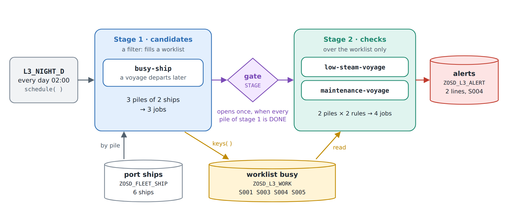
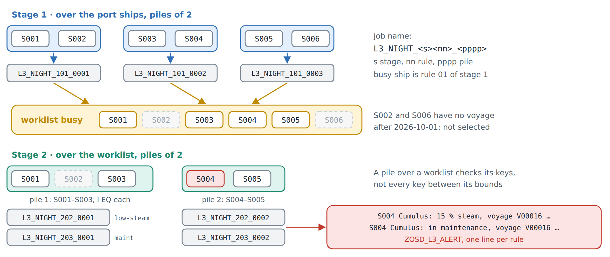
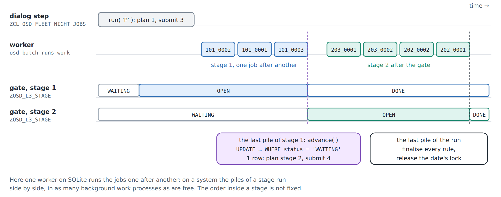
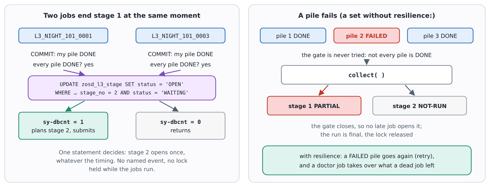

# 16. Orchestration: the night set

Chapter 9 chained two background jobs by hand: one job raised a named event,
the other waited for it, and a doctor explained a chain that did not move.
Chapter 12 wrote one rule in YAML and let a compiler write the ABAP. This
chapter does both at once. A **set** of rules, described in one YAML file
(open-steamgate's DSL L3), becomes a runner class and a job report. They
split the work into jobs, run them in stages, open the next stage exactly
once, and start the whole set every night.

The night set does two things. First it picks the ships that have a voyage
ahead. Then it runs the deeper checks on those ships only, two ships per job.



## The set

[fleet_night.l3.yaml](../src/l3/fleet_night.l3.yaml):

<!-- code: src/l3/fleet_night.l3.yaml lines 7-24 -->
```yaml
set: night
title: The fleet at night, busy ships first, then the deep checks
date: $date
class: zcl_osd_fleet_night
report: zosd_fleet_night
stages:
  - stage: candidates
    filter: true
    worklist: busy
    piles: {source: ships, size: 2}
    rules:
      - rule: busy_ship.l2.yaml
  - stage: checks
    piles: {source: "worklist:busy", size: 2}
    rules:
      - rule: low_steam_voyage.l2.yaml
      - rule: maintenance_voyage.l2.yaml
schedule: {every: 1d, at: "020000"}
```

- `stages` run in order. Stage n + 1 starts only when every pile of stage n is
  `DONE`.
- `filter: true` makes a stage a filter. Its rules do not raise alerts; they
  hand back keys, and the keys go into the worklist `busy`, the table
  `ZOSD_L3_WORK`.
- `piles` cut the work. Stage 1 reads its keys through the port `ships` and
  cuts them into piles of two ships; stage 2 does the same over the worklist.
  Run in jobs, every pair of a rule and a pile is one job.
- `schedule` makes the set a periodic job: every day at 02:00, system time.

The rest of the file declares the ports: `ships` reads `ZOSD_FLEET_SHIP` by
`SHIP_ID`, and `alerts` writes the alert log `ZOSD_L3_ALERT`.

The filter is an L2 rule like chapter 12's, with two additions,
[busy_ship.l2.yaml](../src/l3/busy_ship.l2.yaml):

<!-- code: src/l3/busy_ship.l2.yaml lines 5-14 -->
```yaml
rule: busy-ship
class: zcl_osd_fleet_l3_busy
title: A ship has a voyage departing after the check date
for: ZOSD_FLEET_SHIP as ship
range: ship.ship_id
keys: true
forbid:
  exists: ZOSD_FLEET_VOY as voy
  where: voy.ship_id = ship.ship_id and voy.dep_date > $date
alert: "{ship.ship_id} {ship.name}: voyage {voy.voyage_id} departs {voy.dep_date}"
```

`range: ship.ship_id` lets a pile restrict the rule to its own ships.
`keys: true` generates a `keys( )` method, which hands back each flagged ship
once. The two checks of stage 2 have the same `range`:
[low_steam_voyage.l2.yaml](../src/l3/low_steam_voyage.l2.yaml) flags a ship
under 30 % steam with a voyage ahead, and
[maintenance_voyage.l2.yaml](../src/l3/maintenance_voyage.l2.yaml) is chapter
12's rule with a `range`, under its own name and class.

## Build it

In an open-steamgate checkout, the three rules first, then the set:

```
for r in busy_ship low_steam_voyage maintenance_voyage; do
  node tools/dsl-l2.mjs build /path/to/osg-demo/src/l3/$r.l2.yaml \
    --out /path/to/osg-demo/src/l3 \
    --ddic /path/to/osg-demo/src/ddic --ddic .local/lars/open-abap-core/src
done
node tools/dsl-l3.mjs build /path/to/osg-demo/src/l3/fleet_night.l3.yaml \
  --out /path/to/osg-demo/src/l3 \
  --ddic /path/to/osg-demo/src/ddic --ddic src/dsl --ddic .local/lars/open-abap-core/src
```

`src/dsl` holds open-steamgate's generic L3 tables, which every set shares:
the worklist, the gate, the plan, the alert log and the run lock
(`ZOSD_L3_RUN`). The compiler writes the runner `ZCL_OSD_FLEET_NIGHT`, the job
report `ZOSD_FLEET_NIGHT`, and the port classes `ZCL_L3_NIGHT_*`; they are
committed in [src/l3](../src/l3). Four small classruns beside them show what
the runner does. They stay in the sandbox: the zip of appendix B leaves
`src/l3` out, because a system would need those generic tables first.

## One step first

Open [ZCL_OSD_FLEET_NIGHT_RUN](../src/l3/zcl_osd_fleet_night_run.clas.abap)
and press **F9**. It calls `run( )` for the check date 2026-10-01 in mode S,
in this dialog step and without a job, then prints what the set's tables hold:

```
Night set, mode S, run 909F6A50966C4439A82BB78C4C27D105: DONE
Stage 1 candidates: DONE
  busy-ship pile 1 S001-S002: DONE, 1 keys
  busy-ship pile 2 S003-S004: DONE, 2 keys
  busy-ship pile 3 S005-S006: DONE, 1 keys
Stage 2 checks: DONE
  low-steam-voyage pile 1 S001-S003: DONE, 0 alerts
  low-steam-voyage pile 2 S004-S005: DONE, 1 alerts
  maintenance-voyage pile 1 S001-S003: DONE, 0 alerts
  maintenance-voyage pile 2 S004-S005: DONE, 1 alerts
Worklist busy: S001 S003 S004 S005
Alert low-steam-voyage: S004 Cumulus: 15 % steam, voyage V00016 departs 20261012
Alert maintenance-voyage: S004 Cumulus: in maintenance, voyage V00016 departs 20261012
2 alerts
```

The run ID differs on every run. `S002 Nimbus` and `S006 Old Boiler` have no
voyage after 2026-10-01, so the filter leaves them out, and the checks never
look at them. `S004 Cumulus` is in maintenance at 15 % steam with a voyage on
the 12th, so both checks flag it.

## In jobs

Mode P is the same set in background jobs. As in chapter 9, this needs SQLite
in a file. In VS Code, **osd: Start** uses file SQLite by default and
supervises the worker (`osd.jobs.worker=auto`); the jobs run without a terminal.

Click **OSD jobs** to open the **OSD Jobs** view. For the readable output
summary, click **OSD running** to open **OSD: What is running?** and choose **Job worker**. Each pile job has its own line; **Show raw job log**
switches the **OSD: Jobs** output to the worker JSON when needed.


For the queue snapshots below, use the checkout route with `STG_DB=file`,
`STG_DB_PATH` and `OSD_PACKS`, and drive the worker yourself.

1. Press **F9** on
   [ZCL_OSD_FLEET_NIGHT_JOBS](../src/l3/zcl_osd_fleet_night_jobs.clas.abap).
   It calls `run( )` with mode P, which opens stage 1, plans it, and submits
   one job per pile. Nothing runs yet:

   ```
   Night set, mode P, run 552BCB76652E4D35A493106C67ED4742: SUBMITTED
   Stage 1 candidates: OPEN
     busy-ship pile 1 S001-S002: PLANNED, 0 keys in job L3_NIGHT_101_0001
     busy-ship pile 2 S003-S004: PLANNED, 0 keys in job L3_NIGHT_101_0002
     busy-ship pile 3 S005-S006: PLANNED, 0 keys in job L3_NIGHT_101_0003
   Stage 2 checks: WAITING
   Worklist busy:
   0 alerts
   ```

   If it answers `BUSY`, a run in jobs for that date is still open: run the
   worker until its queue is empty, then press F9 again. If a pile of that
   run failed, it stays open until `collect( )` (see below).

2. Run the worker as in chapter 9: in the checkout, with the same `STG_DB` and
   `STG_DB_PATH` but without `OSD_PACKS`, run
   `node tools/osd-batch-runs.mjs work` until it answers `"kind": "empty"`,
   or keep `worker` running (Ctrl+C stops it). The worker runs seven jobs.
   First come the three of stage 1, in any order. The last of them opens
   stage 2 and submits four more, `L3_NIGHT_202_*` and `L3_NIGHT_203_*`, and
   the worker runs those too.
3. Press **F9** on
   [ZCL_OSD_FLEET_NIGHT_STATE](../src/l3/zcl_osd_fleet_night_state.clas.abap).
   It finds the latest run in jobs for the date and prints it. Every pile is
   `DONE` and names its job, and the worklist and the two alerts are those of
   mode S:

   ```
   Stage 2 checks: DONE
     low-steam-voyage pile 1 S001-S003: DONE, 0 alerts in job L3_NIGHT_202_0001
     low-steam-voyage pile 2 S004-S005: DONE, 1 alerts in job L3_NIGHT_202_0002
     maintenance-voyage pile 1 S001-S003: DONE, 0 alerts in job L3_NIGHT_203_0001
     maintenance-voyage pile 2 S004-S005: DONE, 1 alerts in job L3_NIGHT_203_0002
   ```

   Press it between two `work` calls to watch the gates move.

## Piles and job names



A job name says where its pile belongs: `L3_NIGHT_<s><nn>_<pppp>` is stage `s`,
rule `nn` (numbered across the set) and pile `pppp`. So `L3_NIGHT_203_0002` is
stage 2, rule 3 (`maintenance-voyage`), pile 2.

A pile of stage 2 is the worklist's keys between its bounds, each as `I EQ`.
Pile 1 shows `S001-S003`, but it checks only `S001` and `S003`: `S002` lies
between the bounds and is not on the worklist, so it is not checked. A plain
`BT` of the bounds would check keys the filter rejected.

## The gate

Nothing waits for an event. Each pile job sets its pile `DONE`, commits, and
calls `advance( )` for its stage. `advance( )` counts the stage's piles that
are not `DONE`; while one is left, it returns. The job that finds none marks
its stage `DONE` and opens the next one with one statement:

<!-- code: src/l3/zcl_osd_fleet_night.clas.abap lines 478-484 -->
```abap
UPDATE zosd_l3_stage SET status = 'OPEN' opened = lv_stamp
  WHERE set_name = c_set AND run_id = iv_run
    AND stage_no = lv_stage
    AND status = 'WAITING'.
IF sy-dbcnt <> 1.
  RETURN.
ENDIF.
```



Only the job whose `UPDATE` changed the row plans stage 2 and submits its
jobs. The job that ends the last stage marks every rule final and releases the
lock on the date, so a run in jobs completes itself. Nobody has to poll it, and
the next night's run is let in.

## When two jobs finish together, and when a pile fails



These cases are not run in this chapter. They are how open-steamgate's
[DSL L3 documentation](https://github.com/oisee/open-steamgate/blob/vscode-v0.6.1650/docs/dsl-l3.md)
("The worklist and the gate") describes the generated runner, and its own
tests check them.

- Two jobs can end stage 1 at the same moment, both see every pile `DONE`, and
  both send the `UPDATE`. One gets `sy-dbcnt = 1` and goes on; the other gets 0
  and returns. Stage 2 opens once.
- A pile whose job fails is not `DONE`, so nobody tries the gate, and the run
  stays open and holds the lock on its date. Something has to call the
  runner's `collect( )`; nothing in the night set does on its own. `collect( )`
  reads each open pile's job with `SHOW_JOBSTATE`; a job that ended without its
  pile `DONE`, while the pile is still that job's, makes the pile `FAILED`.
  Once the rest of the stage is final, it marks the stage `PARTIAL` and every
  later stage `NOT-RUN`. That closes the gate, so a late job cannot open it.
  Then the run is final and the lock released.
- A duplicate or late job returns `NOT-PLANNED` for a pile already claimed
  or finished. A job whose run no longer holds the date lock returns
  `STALE-RUN`. These guards also apply to the night set without `resilience:`.

A set can also declare `resilience:`: a failed pile goes again after a backoff,
the default daemon doctor takes over what a dead job left, and fuses can stop a run. The
night set does not use it, to stay small; the documentation's "Resilience"
section describes it.

## Every night

[ZCL_OSD_FLEET_NIGHT_SCHEDULE](../src/l3/zcl_osd_fleet_night_schedule.clas.abap)
switches the schedule. Press **F9** once:

```
Scheduled L3_NIGHT_D 11001000; again: 11001000
Waiting: '11001000'
```

The job count differs on every run.

`schedule( )` opens the driver job `L3_NIGHT_D` and releases it for 02:00
system time with a period of one day. The classrun calls it twice; the
second call finds the waiting instance and schedules nothing. Each night the
driver calls `run( )` for that day in mode P, and the jobs above follow.

Press **F9** again to switch it off:

```
Unscheduled L3_NIGHT_D 11001000: 1 deleted, 0 refused
Waiting: ''
```

`unschedule( )` returns separate `deleted` and `refused` counts; here it
deletes the waiting instance, which ends the chain. A
`node tools/osd-batch-runs.mjs work` afterwards answers `"kind": "empty"`:
nothing of the set is left to run (with the queue empty, as after step 2).

## Compared with chapter 9

| | Chapter 9's chain | The night set |
|---|---|---|
| Written as | ABAP: `JOB_OPEN`, `SUBMIT VIA JOB`, `JOB_CLOSE` with an event | YAML; the ABAP is generated |
| Order | the second job waits for a named event | a gate row per stage, opened by one `UPDATE` |
| Parallel work | one job per step | one job per rule and pile |
| A step fails | the waiting job stays `WAITING`; the doctor explains it | the run stays open until `collect( )` makes the stage `PARTIAL` and the rest `NOT-RUN` |
| Every night | not shown | a periodic driver job, by time: `schedule( )`, `unschedule( )` |

The set's gates are its own: they open only the set's next stage. Nothing
outside the set can wait for them as it could for a named event. On SQLite
one worker runs the jobs one after another. On a system, the piles of a stage
run side by side in as many background work processes as are free, and the
order of jobs within a stage is not fixed in either place. Mode P was run
here only on SQLite with one worker, never on a system.

`node test/l3.mjs` (appendix A) runs this chapter's steps against a real
engine: mode S, mode P with the worker, the state, and the schedule switch.
It does not run the two cases of the gate picture, nor the driver's start at
02:00: it checks that the driver waits and is deleted.
