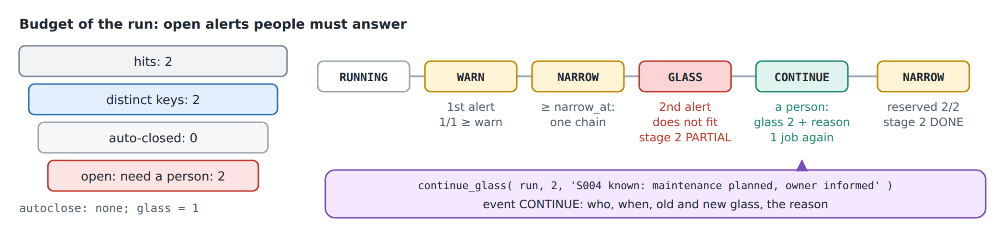

# 17. The governor: a budget for people

The night set of chapter 16 checks every busy ship and writes an alert for
each problem it finds. Somebody has to read those alerts. On a bad night a
check can write thousands of them, and nobody can answer thousands. A
**governor** gives a run a budget: how many open alerts the people behind it
can take. When the budget is spent the run stops, and only a person can let it
go on, with a reason that stays in the run's history.

This chapter puts the night set under a governor with the smallest budget
there is, one open alert, so that the fleet's two alerts on `S004 Cumulus`
cannot both get through.

## The set

[fleet_watch.l3.yaml](../src/l3/fleet_watch.l3.yaml) is the night set with a
new name, `watch`: the same stages, rules and ports, no schedule, and three
blocks more:

<!-- code: src/l3/fleet_watch.l3.yaml lines 47-55 -->
```yaml
resilience:
  retry: {max: 2, backoff: 60}
  stale: 900
  keep: {days: 30}
governor:
  budget: {glass: 1, counts: open, warn: 0.7, narrow_at: 0.8, per_pile: 0}
  funnel: {group_by: object, autoclose: port:close}
settings:
  tunable: [budget.glass]
```

- `resilience` is what a governor needs underneath: a failed pile goes again,
  and a doctor job takes over what a dead job left (chapter 16 named it).
- `glass` is the budget: the number of open alerts a run may have. The name
  comes from "break the glass": past it, a person has to act.
- `warn` and `narrow_at` are fractions of the glass. At `warn` the run notes
  it once; at `narrow_at` it narrows to one chain of jobs at a time.
- `per_pile: 0` switches off a separate cap per pile.
- `funnel` decides what counts. An alert counts once per rule, run and ship
  (`group_by: object`): two hits on one ship by one rule are one alert. The
  port `close` may close alerts on its own, for example for ships whose case
  is already known; closed alerts give their place in the budget back. Here
  it is bound to `none`, which closes nothing.
- `settings` makes `budget.glass` a value that can be changed without a new
  build. It applies to later runs, never to a run already started.

Build it like the night set (chapter 16) with `tools/dsl-l3.mjs build`. The
compiler writes the runner `ZCL_OSD_FLEET_WATCH`, its job report
`ZOSD_FLEET_WATCH`, the ports `ZCL_L3_WATCH_*`, and the settings classes
`ZCL_L3_WATCH_CONF` and `ZL3_WATCH_CONF`. The budget lives in open-steamgate's
generic table `ZOSD_L3_BUDGET`, the history of the run in `ZOSD_L3_EVENT`.



## The run stops at its glass

Start OSD with a file database, as in chapter 16.

1. Press **F9** on
   [ZCL_OSD_FLEET_WATCH_JOBS](../src/l3/zcl_osd_fleet_watch_jobs.clas.abap). It
   starts the set in jobs for 2026-10-01 and prints
   `Watch set, mode P, run <ID>: SUBMITTED`.
2. Run the worker until its queue is empty, as in chapter 16. It runs seven
   jobs, as for the night set.
3. Press **F9** on
   [ZCL_OSD_FLEET_WATCH_STATE](../src/l3/zcl_osd_fleet_watch_state.clas.abap).
   It prints the latest run of the set for the date:

   ```
   Watch set, run B2179C23A3CF434380CA033254965E8D
   Stage 1 candidates: DONE
     busy-ship pile 1: DONE
     busy-ship pile 2: DONE
     busy-ship pile 3: DONE
   Stage 2 checks: PARTIAL
     low-steam-voyage pile 1: DONE
     low-steam-voyage pile 2: GLASS (GLASS)
     maintenance-voyage pile 1: DONE
     maintenance-voyage pile 2: DONE
   Budget: GLASS, glass 1, reserved 1, consumed 1, refunded 0
   Event 1 WARN: glass 1, reserved 1
   Event 2 NARROW: glass 1, reserved 1
   Event 3 GLASS: glass 1, reserved 1, amount 1, "reservation does not fit"
   Event 4 GLASS-STAGE: glass 1, reserved 1, amount 2
   Alert maintenance-voyage: S004 Cumulus: in maintenance, voyage V00016 departs 20261012
   1 alerts
   ```

The jobs of stage 2 run in any order, so on your run the other rule may be the
one that got through.

Read it from the budget up:

- Before a pile writes an alert, it reserves a place in the budget with one
  conditional `UPDATE`. The first S004 alert fits: `reserved 1` of
  `glass 1`.
- The thresholds are checked after each admission, as reserved against
  glass. With a glass of one, the first alert already passes 0.7 and 0.8, so
  `WARN` (written once per run) and `NARROW` come at once.
- The second S004 alert does not fit. Its pile writes nothing and stops as
  `GLASS`, the run's budget turns `GLASS`, and the stage is stopped:
  `GLASS-STAGE` with `amount 2`, the number of the stage it turned from `OPEN`
  to `PARTIAL`.
- The run keeps its lock on the date. No new pile starts, `resume( )` and the
  doctor leave it as it is: the budget does not refill on its own.

## A person continues it

[ZCL_OSD_FLEET_WATCH_GLASS](../src/l3/zcl_osd_fleet_watch_glass.clas.abap)
plays the person. It calls

<!-- code: src/l3/zcl_osd_fleet_watch_glass.clas.abap lines 23-25 -->
```abap
lv_ok = zcl_osd_fleet_watch=>continue_glass( iv_run = lv_run
                                             iv_new_glass = ls_budget-glass + 1
                                             iv_reason = c_reason ).
```

with a reason, here `S004 known: maintenance planned, owner informed`. The
new glass must be higher than the old one, and the reason may not be empty.

1. Press **F9** on it. Expected:
   `Continue run <ID> with glass 2: X`.
2. Run the worker again. It runs one job: the pile that stopped at the glass.
3. Press **F9** on `ZCL_OSD_FLEET_WATCH_STATE` again. Expected, besides the
   lines above:

   ```
   Stage 2 checks: DONE
     low-steam-voyage pile 2: DONE (STALE-PLAN)
   Budget: NARROW, glass 2, reserved 2, consumed 2, refunded 0
   Event 5 CONTINUE: glass 2, reserved 1, amount 2, "S004 known: maintenance planned, owner informed" by DEVELOPER
   Event 6 NARROW: glass 2, reserved 2
   Alert low-steam-voyage: S004 Cumulus: 15 % steam, voyage V00016 departs 20261012
   Alert maintenance-voyage: S004 Cumulus: in maintenance, voyage V00016 departs 20261012
   2 alerts
   ```

`CONTINUE` records who let the run go on, when, the new glass and the reason;
`DEVELOPER` is OSD's local user. `continue_glass( )` reopens only the stages
the glass stopped (`GLASS-STAGE`), plans the stopped pile again and resumes
the run. The pile's reason `STALE-PLAN` says why it was sent again, not how
it ended: it was planned and had no job. The run completes as in chapter 16
and releases its lock.

## Three limits

A governed set has three limits, and they answer different questions:

| Limit | Counts | When it is passed |
|---|---|---|
| `budget.glass` | open alerts in the run, each ship once per rule | `GLASS`: the run waits for a person |
| `budget.per_pile` | candidate open alerts in one pile | the pile is `HELD`; `release_pile( )` with a reason lets it go |
| `resilience.fuses.max_alerts` | every alert row of a rule in the run | the rule is `FUSED` and stops writing |

The watch set uses only the glass. The other two are described in
open-steamgate's
[DSL L3 documentation](https://github.com/oisee/open-steamgate/blob/vscode-v0.6.1531/docs/dsl-l3.md)
("Governor: the manual-handling budget", "Fuses"), and are not run here.

## What this chapter does not show

- An autoclose port that closes alerts and gives their place back. The fleet
  has none of its own here; `close: none`.
- A run in one step (mode S) under a governor, and the race of two piles for
  the last place in the budget. open-steamgate's own tests run both.
- A person on a screen. Here a classrun stands in for the person. A generated
  console for runs, with the budget, the events and a button for "continue",
  is in progress in open-steamgate and is not in 0.6.1531.

`node test/l3.mjs` (appendix A) runs this chapter's steps against a real
engine: the run that stops at its glass (G1) and the continuation that
completes it (G2).
