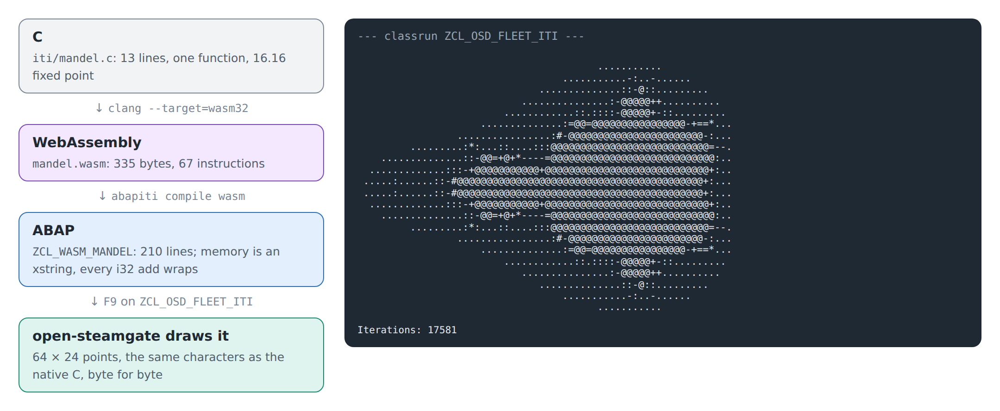

# 18. Because we can: C in ABAP

Every other chapter takes ABAP somewhere: to a service, to a browser, to the
command line. This one goes the other way. A small C function becomes an ABAP
class, and the fleet's system runs it. The tool is
[abapiti](https://github.com/oisee/abapiti), whose README begins with "because
we can". It compiles WebAssembly, LLVM IR and TypeScript into ABAP, and says
of itself that it is a research toy that happens to produce ABAP a real SAP
system accepts.

Nothing in this chapter is about the fleet. It is here because it is fun, and
because it shows, from an unusual side, what a local ABAP system runs and
where it differs from a real one.



## The C

[iti/mandel.c](../iti/mandel.c) counts, for a point of the plane, how many
steps of the Mandelbrot iteration it takes until |z|² passes 4, in 16.16 fixed
point so that no floating point is needed:

<!-- code: iti/mandel.c lines 1-13 -->
```c
/* Iterations of z = z*z + c at one point, in 16.16 fixed point, at most max. */
int mandel(int cx, int cy, int max) {
  int x = 0, y = 0, i = 0;
  while (i < max) {
    long long xx = (long long)x * x >> 16, yy = (long long)y * y >> 16;
    if (xx + yy > (4 << 16)) break;
    int xy = (int)((long long)x * y >> 16);
    x = (int)(xx - yy) + cx;
    y = 2 * xy + cy;
    i++;
  }
  return i;
}
```

## Into ABAP

[iti/build.sh](../iti/build.sh) does it in two steps, and also builds
abapiti. Run it with `ABAPITI` set to an abapiti checkout; it needs clang with
the `wasm32` target, `wasm-ld` and Go:

```
clang --target=wasm32 -O2 -nostdlib -Wl,--no-entry -Wl,--export=mandel \
  -o iti/mandel.wasm iti/mandel.c
abapiti compile wasm iti/mandel.wasm -o out/
```

clang makes 335 bytes of WebAssembly: one function of 67 instructions. abapiti
makes of them the class
[ZCL_WASM_MANDEL](../src/iti/zcl_wasm_mandel.clas.abap), 210 lines, committed
here. Its public part is one method per exported function:

```abap
METHODS mandel IMPORTING p0 TYPE i p1 TYPE i p2 TYPE i RETURNING VALUE(rv) TYPE i.
```

The rest is a small machine. WebAssembly is a stack machine, so the method
works through variables `s0`, `s1`, … standing for the stack, and a counter
`lv_br` stands for its jumps out of nested blocks. The chapter's build used
abapiti `3e92daf`; the class is not meant to be read, and it has no comments
on purpose (see below).

## The drawing

[ZCL_OSD_FLEET_ITI](../src/iti/zcl_osd_fleet_iti.clas.abap) asks the class for
every point of a 64 × 24 grid and prints a character per point, from blank
(escapes within a few steps) to `@` (never escapes). Press **F9** on it.
Expected: the picture above, and the line `Iterations: 17581`, the sum of all
the counts.

[iti/draw.c](../iti/draw.c) draws the same grid from the same C, compiled for
your own machine (`cc -O2 iti/draw.c iti/mandel.c && ./a.out`). Its output is
committed as [iti/mandel.expected.txt](../iti/mandel.expected.txt), and
`test/iti.mjs` (appendix A) checks two things: that native C still prints that
file, and that the classrun in open-steamgate prints the same 25 lines, byte
for byte.

One line of the classrun is not where you would look for trouble:

<!-- code: src/iti/zcl_osd_fleet_iti.clas.abap lines 31-31 -->
```abap
lv_cy = -81920 + lv_row * 163840 DIV ( c_rows - 1 ).
```

In C, `/` on integers cuts the fraction off. In ABAP, `/` on integers rounds.
For the drawing to match the C character for character, the classrun uses
`DIV`, which cuts like C does for these positive numbers.

## What a CPU does for free

The interesting part of the class is what it has to spell out. WebAssembly's
`i32.add` simply wraps around, modulo 2³²; an ABAP `TYPE i` addition that
leaves the range raises an exception. (In C, a signed overflow is not even
defined; this drawing never comes near one.) So every 32-bit addition in the
generated code goes through a helper:

<!-- code: src/iti/zcl_wasm_mandel.clas.abap lines 111-120 -->
```abap
METHOD i32_add.
  DATA lv_p TYPE p LENGTH 16 DECIMALS 0.
  lv_p = iv_a.
  lv_p = lv_p + iv_b.
  lv_p = lv_p MOD 4294967296.
  IF lv_p >= 2147483648.
    lv_p = lv_p - 4294967296.
  ENDIF.
  rv = lv_p.
ENDMETHOD.
```

WebAssembly's memory is one array of bytes. Here it is an `xstring`, and a
store of four bytes is a `REPLACE SECTION` in byte mode, after turning the
value little-endian by hand:

<!-- code: src/iti/zcl_wasm_mandel.clas.abap lines 54-63 -->
```abap
METHOD mem_st_i32.
  DATA lv_le TYPE x LENGTH 4.
  DATA lv_be TYPE x LENGTH 4.
  lv_be = iv_val.
  lv_le+0(1) = lv_be+3(1).
  lv_le+1(1) = lv_be+2(1).
  lv_le+2(1) = lv_be+1(1).
  lv_le+3(1) = lv_be+0(1).
  REPLACE SECTION OFFSET iv_addr LENGTH 4 OF mv_mem WITH lv_le IN BYTE MODE.
ENDMETHOD.
```

`mandel` itself never touches memory: its numbers all live in variables.
Bigger programs do, and that is where the stories below come from.

## Stories from abapiti

These are abapiti's own findings, told by its authors, measured on their
programs on A4H, on the abaplint JavaScript runtime that open-steamgate's
JavaScript side builds on, and on open-steamgate's Go runtime (osgo). This
chapter did not repeat them.

- **The loop that did not end.** A WebAssembly jump to a loop's label means
  "go round again". abapiti first wrote `EXIT` for it. A quicksort hung at two
  elements, and on A4H its background job ran 565 seconds until it was killed
  in SM37. Since then abapiti's test jobs write a status message at every
  step, so a hang shows where it is. Fixed in abapiti #11; the `CONTINUE` near
  the end of `mandel` above is that fix.
- **Packed numbers in JavaScript.** On a real system `p LENGTH 16` is exact.
  The abaplint JavaScript runtime keeps it as a double, which is exact only up
  to 2⁵³: 94906267² mod 2³² came out one too low, and the same quicksort gave
  wrong checksums. osgo and A4H were exact. abapiti moved its 64-bit work to
  `int8`, which is exact in JavaScript too and was about 13 % faster on A4H.
  (The abapiti version this chapter pins, `3e92daf`, still uses `p` in
  `i32_add`; its sums stay far below 2⁵³. Later versions use `int8` there
  too.)
- **Wrapping costs.** Going through a method for every addition more than
  doubles the time of a tight loop: on A4H, in a background job, 10,000 steps
  of a random-number generator took 12 ms that way and 5.3 ms with the
  arithmetic written inline.
- **No casting.** Reading four bytes of memory as an `i` with `ASSIGN ...
  CASTING` dumps on A4H with `ASSIGN_BASE_WRONG_ALIGNMENT`. Hence the byte
  shuffling above.
- **255 characters.** ADT refuses a source line longer than 255 characters, so
  the generated code wraps its long lines. It has no comments either: once,
  statements packed onto a line after an end-of-line comment became part of
  the comment, and the class did not activate ("ENDDO without DO"). One method
  of 150,000 lines and a class of 150 methods did activate.
- **The memory in place.** `REPLACE SECTION` of the same length changes an
  `xstring` in place and was about twice as fast as keeping memory in an
  internal table. In the abaplint JavaScript runtime an `xstring` is a hex
  string, so every store copies it.
- **Speed.** A quicksort of 500 numbers took 10.8 ms on A4H as a background
  job and about 1.3 s on the abaplint JavaScript runtime, some 120 times
  slower. On A4H the checksums matched the native ones for every size
  measured, from 1 to 500.

## Where the local system differs

The drawing is a small program: 1,536 calls, numbers far from any limit, and
no memory. It comes out the same on the local system as natively. The stories
above show where a program that leans on the edges of ABAP, its packed
numbers, its integer overflow, its memory, can behave differently on the local
system than on a real one. abapiti keeps small ABAP repros of those edges,
measured on a real system, so the differences can be fixed in open-steamgate
one by one.

The generated class and the classrun stay in the sandbox: the zip of appendix
B leaves `src/iti` out.
