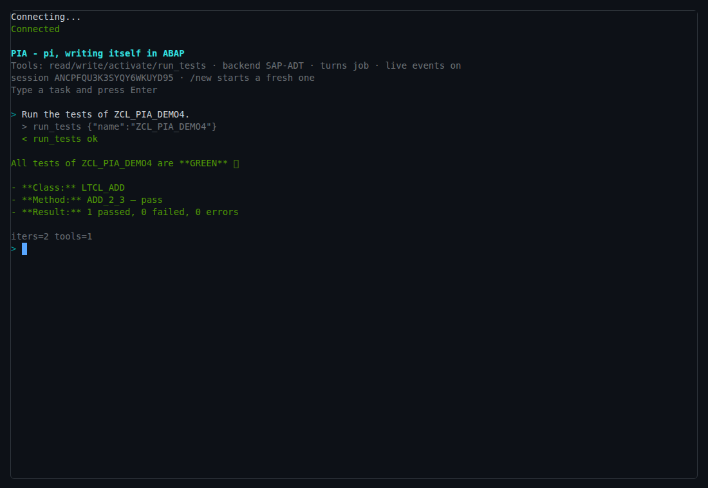
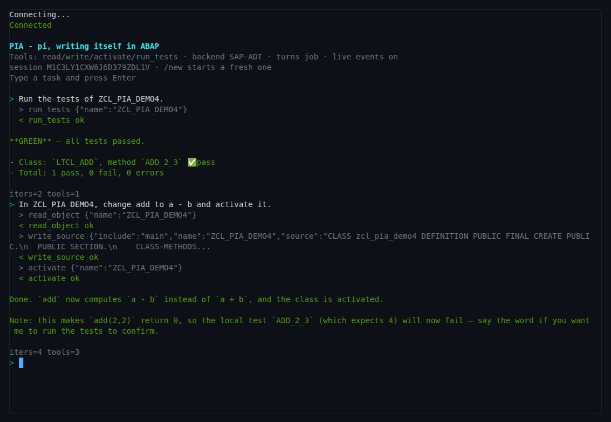
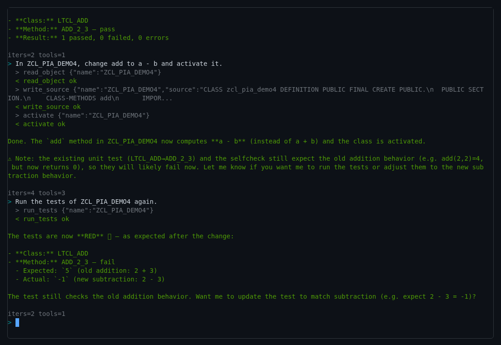
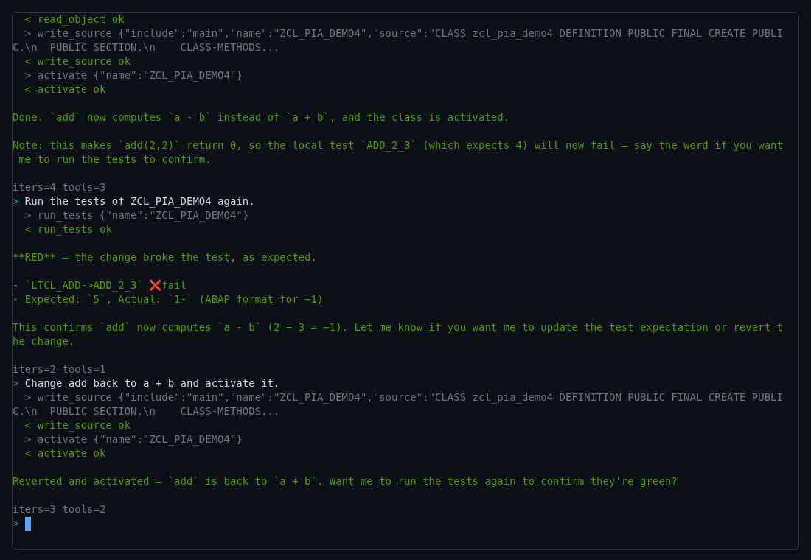
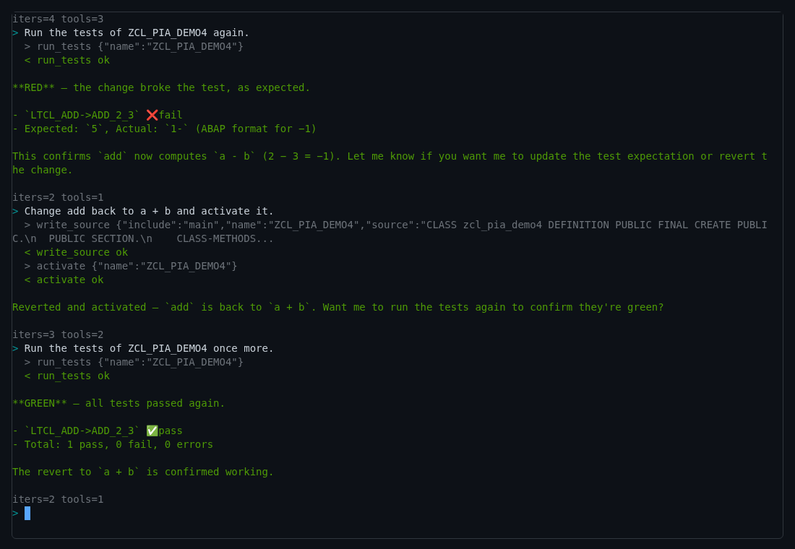
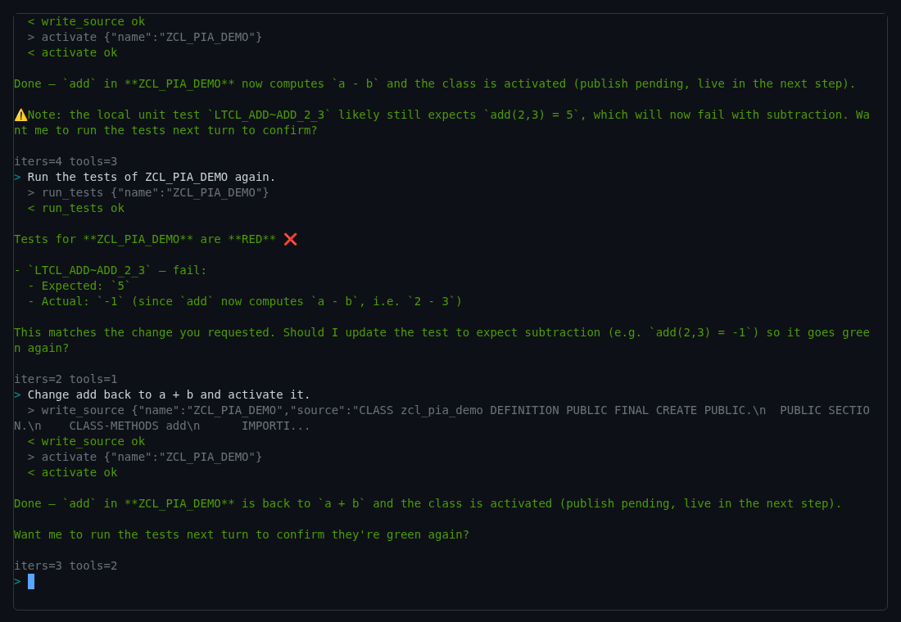
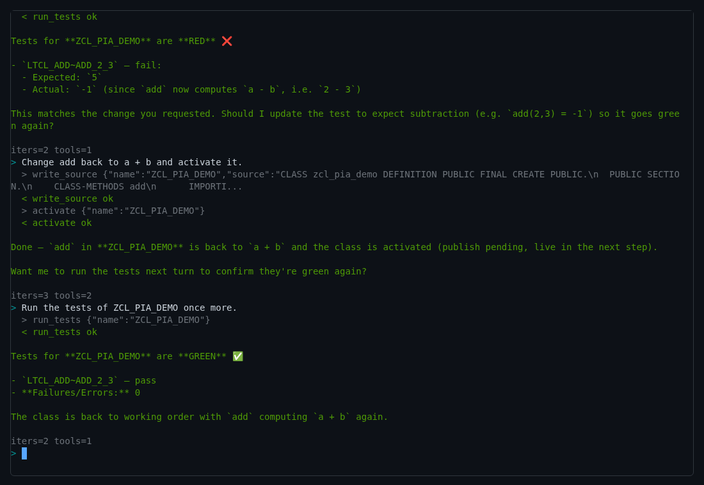

# 19. An agent that writes ABAP from inside the system

The other chapters have a person at the keyboard: you press F9, you read the
console, you change a line. This chapter hands the keyboard to a program.
[PIA](https://github.com/oisee/pia), the Pi-ABAP Agent, is a coding agent
written in ABAP. It runs inside the system it works on. You type a task into
a terminal in your browser; PIA reads the class, writes the change, activates
it and runs its ABAP Unit tests, on that same system and as you.

Everything here is PIA's own, from its releases
[v0.1.0](https://github.com/oisee/pia/releases/tag/v0.1.0) and
[v0.1.1](https://github.com/oisee/pia/releases/tag/v0.1.1). The pictures are
PIA 0.1.1: five on SAP's ABAP Platform Trial (A4H, NetWeaver 7.58), two on
open-steamgate; this chapter did not repeat the runs. The last section says what it takes to run the same thing in your
own sandbox.

## A turn

PIA gives a language model four tools and nothing else:

- `read_object`: the source of a class;
- `write_source`: replace the source of a class, its main part or its test
  classes;
- `activate`: activate the class;
- `run_tests`: run its ABAP Unit tests and return the result.

A turn is a loop. PIA sends the task and the tool descriptions to the model.
The model answers either with text, and the turn ends, or with tool calls;
PIA runs each call and sends the results back, and the model decides again.
A turn may take at most eight steps
([zcl_pia_00_executor](https://github.com/oisee/pia/blob/v0.1.0/src/00/zcl_pia_00_executor.clas.abap)).
A tool is an ABAP class behind one small interface:

```abap
METHODS get_name        RETURNING VALUE(rv_) TYPE string.
METHODS get_description RETURNING VALUE(rv_) TYPE string.
METHODS get_params      RETURNING VALUE(rt_) TYPE tt_params.
METHODS get_permission  RETURNING VALUE(rv_) TYPE string.
METHODS invoke
  IMPORTING iv_arguments TYPE string
            iv_call_id   TYPE string OPTIONAL
  RETURNING VALUE(rs_)   TYPE ts_result.
```

([zif_pia_00_tool](https://github.com/oisee/pia/blob/v0.1.0/src/00/zif_pia_00_tool.intf.abap);
the permission is `READ`, `WRITE` or `EXECUTE`.) The arguments arrive as the
JSON the model wrote; the tool's output goes back to the model as text. The
model in v0.1.0 is z.ai's `glm-5.3`, reached over HTTPS from ABAP.

## Green, red, green

PIA's release test drives the terminal with Playwright
([tui-e2e.mjs](https://github.com/oisee/pia/blob/v0.1.1/osg-probe/ui/tui-e2e.mjs))
through five tasks on a small class, `ZCL_PIA_DEMO4`, whose method `add`
returns `a + b` and whose one test expects `add( 2, 3 )` to be 5. Each line
that starts with `>` is a task; the indented `>` and `<` lines under it are the
tool calls and their results, as they happen. The pictures are PIA 0.1.1 on
A4H ([screenshots/a4h-tui-011](https://github.com/oisee/pia/tree/68431f8/screenshots/a4h-tui-011)).

First, the tests: one tool call, green.



Then a deliberate break: "change add to a - b and activate it". The model
reads the class, writes it back with the change, activates it, and adds on
its own that the test will now fail. (In the English run it also gets the
test's numbers wrong in passing: the test expects 5, not 4. The tests in the
next turn are what count.)



The tests are red: expected 5, actual −1. SAP's test result writes the
negative number as `1-`, with the sign at the end, the ABAP way, and the
model reads it back as −1.



The fix: "change add back to a + b and activate it". Two tool calls.



And the fifth task runs the tests again: green.



The same run passes in English, Danish and Russian: the model answers in the
language of the task. PIA's release reports all fifteen steps passing on A4H.

## One agent, two systems

The tools do not talk to the system themselves; they talk to a development
backend, and a factory picks one when PIA starts
([zcl_pia_20_backend](https://github.com/oisee/pia/blob/v0.1.0/src/20/zcl_pia_20_backend.clas.abap)):

```abap
cl_abap_typedescr=>describe_by_name( EXPORTING p_name = 'ZCL_OSD_ADT_HOST'
                                     EXCEPTIONS type_not_found = 1 OTHERS = 2 ).
lv_class = COND #( WHEN sy-subrc = 0 THEN `ZCL_PIA_20_B_OSG_STORE` ELSE `ZCL_PIA_20_B_ADT` ).
```

- On SAP, `ZCL_PIA_20_B_ADT` speaks ADT, the same REST interface a
  development environment uses, to the system it runs in.
  `cl_http_client=>create_internal` opens the connection as the current user
  with no password. PIA writes only to classes that already exist, and only
  in local packages (`$…`).
- On open-steamgate, `ZCL_PIA_20_B_OSG_STORE` talks to the runtime directly:
  a tracked activation that reports when the new code is published, and
  `RUN_TESTS` on that published generation. PIA's README gives about 2.6
  seconds for publishing a change to an existing class this way.

Both backends return test results in the same JSON shape, so the tools,
and the model, see one format.

## What SAP does not allow, and what it costs

The terminal is an ABAP Push Channel: a WebSocket served by ABAP. The
natural design runs the agent's turn right in the push channel's handler.
On A4H that did not work: PIA's porting found that inside an APC handler SAP
refuses ABAP Unit and source writes, two of PIA's four tools. So on SAP each turn runs as a
background job, `PIA_<session>`, and the job streams its tool events back
to the terminal over ABAP Messaging Channels (AMC). PIA's notes measure about
ten seconds for a simple turn, with the first tool event after 4.5 to 5.5
seconds ([porting notes](https://github.com/oisee/pia/blob/v0.1.0/osg-probe/a4h/README.md)).
On open-steamgate PIA runs the turn inside the push channel itself
(`PIA_TURN_MODE=inline`).

## Stories from PIA

These are PIA's own findings, from its reports and porting notes.

- **Who may send.** An AMC channel lists the programs allowed to send on it.
  The check is against the program that calls `send`, not against the one
  that started the work. PIA's listener class carries the comment, and the
  channel definition names each class that sends
  ([zpia_amc.samc.xml](https://github.com/oisee/pia/blob/v0.1.0/src/00/zpia_amc.samc.xml)).
  It holds on SAP and in open-steamgate alike.
- **A space in a header.** The first live call to the model failed with
  "Auth Failed". The authorization header had lost the space in
  `Bearer <key>`. A dump of the outgoing request showed it, and a string
  template fixed it.
- **`VALUE` is not an assignment.** `DATA lv_depth TYPE i VALUE 1` inside a
  loop sets the variable once, when the method starts, not at every pass.
  ABAP declarations are not executable statements. PIA's JSON splitter
  relied on the opposite and produced fifteen stray `{`. Explicit
  assignments and `CLEAR` fixed it. This is ABAP's rule, and a JavaScript
  reader trips on it easily.
- **`\u003e`.** The model sends source code as JSON, and JSON may escape `>`
  as `\u003e`. Until the decoder learned `\u`, `=>` arrived in the class as
  `=u003e`, and the broken class still activated. PIA's report lists the
  open-steamgate side of it ("a broken source activates silently") among
  its findings for open-steamgate.
- **What open-steamgate let through.** Porting to SAP found code that
  open-steamgate had accepted and SAP did not:
  - `DATA x TYPE i VALUE <variable>`;
  - `strlen` and `to_upper` on an `xstring`;
  - source lines over 255 characters.

  On SAP none of them compiles.
- **PIA edits PIA.** Given the task "add a method VERSION to
  ZCL_PIA_00_JSON_UTIL", PIA read one of its own classes, added the method
  and wrote it back. Its own `activate` reported a failure that was not
  one, so the class was activated from outside; after a restart the method
  answered `v0.2-selfhosted`
  ([report](https://github.com/oisee/pia/blob/v0.1.0/reports/2026-10-06-SELF-HOSTING.md)).
  An ABAP agent, written in ABAP, changed its own ABAP.

## The same run on open-steamgate

[PIA 0.1.1](https://github.com/oisee/pia/releases/tag/v0.1.1) runs the same
five turns on open-steamgate. These pictures were taken there, replaying the
recorded model answers described below
([screenshots/osg-tui](https://github.com/oisee/pia/tree/68431f8/screenshots/osg-tui)).
One difference shows in the agent's answers: on open-steamgate an activation
is published at the end of the turn, so the model says "publish pending, live
in the next step", and the tests run in the next turn.





## Running it on your own open-steamgate

PIA 0.1.1 can replay the chapter without a model key. `PIA_LLM=record:<file>`
in `pia-settings.env` (settings without secrets, next to `pia.env`) writes
every model answer to a file; `PIA_LLM=replay:<file>` answers from it, in
order, with no key and no network. The tools still run for real. The release
carries `pia-chapter.rec`: the five-turn scenario in English, Danish and
Russian, recorded on open-steamgate. Delete `pia-chapter.rec.pos` to start
over ([release notes](https://github.com/oisee/pia/releases/tag/v0.1.1)).

It does not run yet on the open-steamgate release this book is written for.
PIA's release notes name what the terminal still needs on open-steamgate and
what is not in a release yet:
- AMC channel extensions;
- publishing at the end of an APC step;
- a runtime recycle that must not drop the connection in the middle of a
  turn.

<!-- hands-on: after the OSG release with AMC channel extensions, publish at the end of an APC step and the quiet-recycle fix -->

On SAP, PIA installs today: an abapGit zip, two certificates for the model's
host, a key file, and the terminal at `/sap/bc/zpia_tui/`. The
[README](https://github.com/oisee/pia/blob/v0.1.1/README.md) has the steps.
