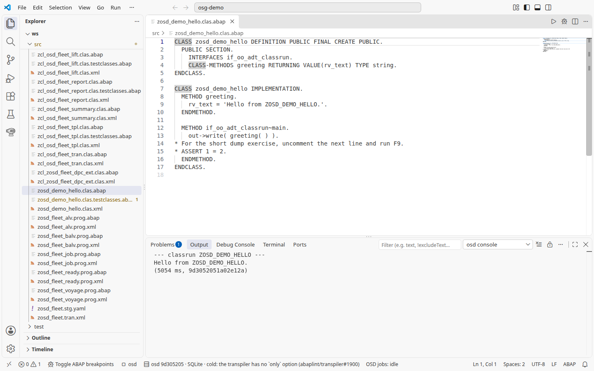
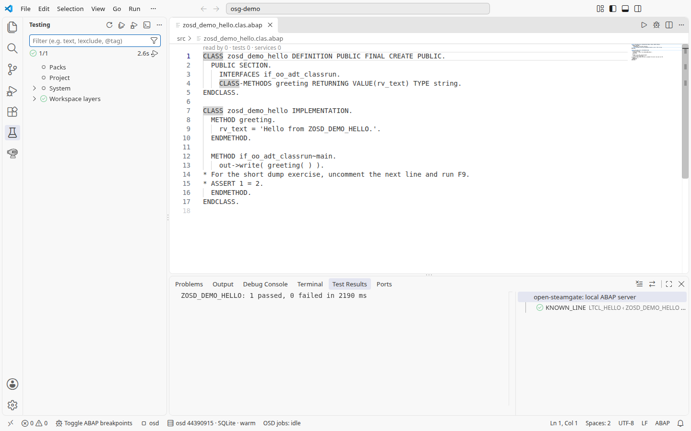

# 1. Hello

1. Откройте [ZOSD_DEMO_HELLO](../../src/zosd_demo_hello.clas.abap), поставьте курсор в класс и нажмите **F9**. Ожидается: **osd console** показывает `Hello from ZOSD_DEMO_HELLO.` Если F9 вместо этого ставит точку останова, значит, отладчик остановлен на строке: остановите сеанс (**Run > Stop Debugging**, Shift+F5) и снова нажмите F9; если F9 по-прежнему переключает точку останова, проверьте, что настройка `osd.keymap` имеет значение `abap`.

   

2. Откройте Testing, раскройте **Workspace layers > osg-demo > ZOSD_DEMO_HELLO** и запустите `known_line`; либо откройте тестовый include [zosd_demo_hello.clas.testclasses.abap](../../src/zosd_demo_hello.clas.testclasses.abap) и нажмите там **Ctrl+Shift+F10** или нажмите ее в самом классе. Ожидается: один зеленый тест ABAP Unit.

   

3. Измените текст, который возвращает `greeting( )`, нажмите **Ctrl+F2** для проверки, **Ctrl+F3** для сохранения и активации, затем снова **F9**. Ожидается: консоль показывает ваш новый текст. Верните исходный текст, активируйте и перезапустите тест, чтобы он остался зеленым.

## Под капотом

Класс возвращает свою строку из одного метода, а его classrun ее печатает:

<!-- code: src/zosd_demo_hello.clas.abap method greeting -->
```abap
METHOD greeting.
  rv_text = 'Hello from ZOSD_DEMO_HELLO.'.
ENDMETHOD.
```

Тест закрепляет эту строку:

<!-- code: src/zosd_demo_hello.clas.testclasses.abap method known_line -->
```abap
METHOD known_line.
  cl_abap_unit_assert=>assert_equals(
    act = zosd_demo_hello=>greeting( )
    exp = 'Hello from ZOSD_DEMO_HELLO.' ).
ENDMETHOD.
```
