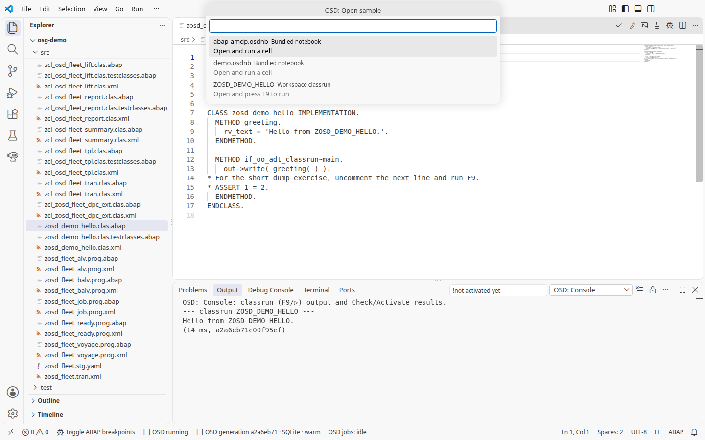

# 1. Hello

Самый быстрый старт — команда **OSD: Open sample** в палитре команд.
Выберите **ZOSD_DEMO_HELLO** и нажмите **F9**; доступны также встроенные
блокноты. Если OSD остановлен, команда предлагает **Start system**.



Строка состояния отдельно показывает **OSD running/stopped**, **OSD generation
<id> · SQLite · warm** и **OSD jobs: …**. Щелчок по системе
открывает **What is running?** с действиями для системы, обработчика,
примеров и обзора; щелчок по заданиям открывает представление **OSD Jobs**.

1. Откройте [ZOSD_DEMO_HELLO](../../src/zosd_demo_hello.clas.abap), поставьте курсор в класс и нажмите **F9**. Ожидается: вывод **OSD: Console** показывает `Hello from ZOSD_DEMO_HELLO.` Если F9 вместо этого ставит точку останова, значит, отладчик остановлен на строке: удалите точки останова ABAP (**Run > Remove All Breakpoints**), остановите сеанс (**Run > Stop Debugging**, Shift+F5) и снова нажмите F9; если F9 по-прежнему переключает точку останова, проверьте, что настройка `osd.keymap` имеет значение `abap`.

   

2. Откройте Testing, раскройте **Workspace layers > osg-demo > ZOSD_DEMO_HELLO** и запустите `known_line`; либо откройте тестовый include [zosd_demo_hello.clas.testclasses.abap](../../src/zosd_demo_hello.clas.testclasses.abap) и нажмите там **Ctrl+Shift+F10** или откройте сам класс и нажмите **Ctrl+Shift+F10** в нем. Ожидается: один зеленый тест ABAP Unit.

   

3. Измените текст, который возвращает `greeting( )`, нажмите **Ctrl+F2** для проверки, **Ctrl+F3** для сохранения и активации (или галочку и спичку в заголовке редактора; обе пишут результат в **OSD: Console**), затем снова **F9**. Ожидается: консоль показывает ваш новый текст. Если нажать F9 после сохранения, но до активации, консоль предупредит, что изменения ещё не активированы, и выполнит активную версию. Верните исходный текст, активируйте и перезапустите тест, чтобы он остался зеленым.

## Под капотом

Класс возвращает свою строку из одного метода, а его classrun ее печатает:

<!-- code: src/zosd_demo_hello.clas.abap method greeting -->
```abap
METHOD greeting.
  rv_text = 'Hello from ZOSD_DEMO_HELLO.'.
ENDMETHOD.
```

Тест закрепляет эту строку:

<!-- code: src/zosd_demo_hello.clas.testclasses.abap method known_line -->
```abap
METHOD known_line.
  cl_abap_unit_assert=>assert_equals(
    act = zosd_demo_hello=>greeting( )
    exp = 'Hello from ZOSD_DEMO_HELLO.' ).
ENDMETHOD.
```
