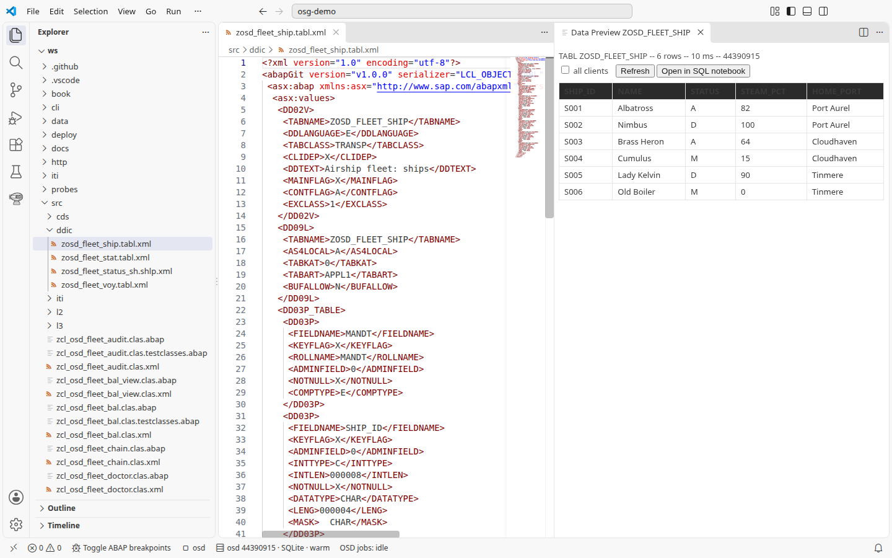
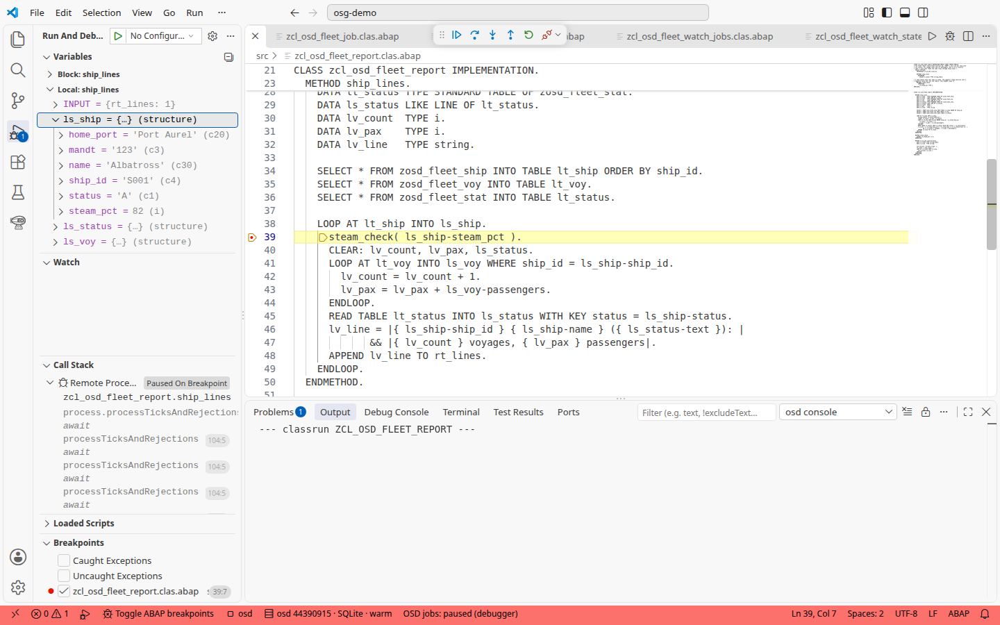
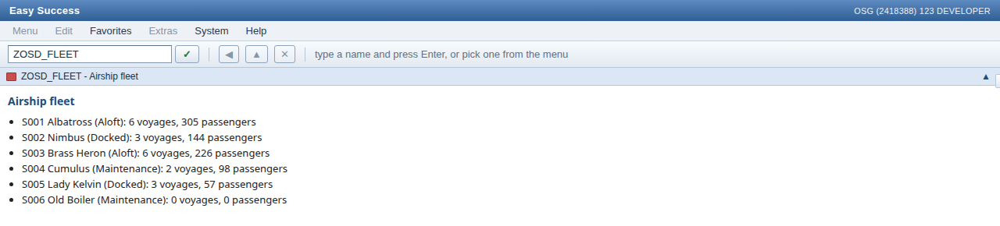
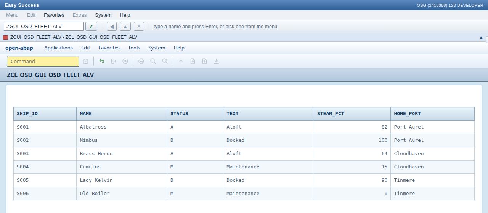

# 2. Отладка, тесты и дампы

Дальше в руководстве используется флот дирижаблей: шесть кораблей и их рейсы, которые записываются как начальные строки (seed) в `ZOSD_FLEET_SHIP`, `ZOSD_FLEET_VOY` и `ZOSD_FLEET_STAT` при каждом запуске системы (см. [контракт](../../docs/fleet-contract.md)).

Чтобы посмотреть данные, откройте одно из определений ниже и нажмите **F8**. Расширение открывает Data Preview; он читает строки, записанные из `data/` при запуске системы. Сначала выйдите из активного сеанса отладки, так как при отладке ABAP клавиша F8 управляет выполнением.

| Определение | Ожидаемые строки |
| --- | ---: |
| [ZOSD_FLEET_SHIP](../../src/ddic/zosd_fleet_ship.tabl.xml) | 6 кораблей |
| [ZOSD_FLEET_VOY](../../src/ddic/zosd_fleet_voy.tabl.xml) | 20 рейсов |
| [ZOSD_FLEET_STAT](../../src/ddic/zosd_fleet_stat.tabl.xml) | 3 статуса |
| [ZC_OSD_FLEETCUBE](../../src/cds/zc_osd_fleetcube.ddls.asddls) | 20 строк рейсов (глава 5) |



1. Откройте [ZCL_OSD_FLEET_REPORT](../../src/zcl_osd_fleet_report.clas.abap) и нажмите **F9**. Ожидается: консоль показывает `Airship fleet` и по одной строке на корабль, начиная с `S001 Albatross (Aloft): 6 voyages, 305 passengers` и заканчивая `S006 Old Boiler (Maintenance): 0 voyages, 0 passengers`.
2. В `ship_lines` поставьте точку останова на `steam_check( ls_ship-steam_pct ).` клавишами **Ctrl+Shift+B** и выполните **osd: Run as ABAP Application with debugger**. Отладчик подключается автоматически. Ожидается: VS Code останавливается на этой строке, в `ls_ship` первый корабль, `S001`. Variables и подсказка при наведении показывают значения ABAP: раскройте `ls_ship`, показанный как `{…} (structure)`, чтобы увидеть компоненты; `ship_id` равен `'S001' (c4)`, а `steam_pct` — `82 (i)`. Таблицы раскрываются в пронумерованные строки. Продолжите клавишей **F8**: пока точка останова на месте, выполнение снова остановится на следующем корабле, поэтому снимите ее (снова **Ctrl+Shift+B**) и нажмите **F8** еще раз; консоль выводит те же шесть строк, что и в шаге 1. После этого остановите сеанс отладки (**Run > Stop Debugging**); F9 и F8 снова запускают код, как только отладчик больше не стоит на строке.

   

3. Намеренно сломайте тест. В [тестовом классе](../../src/zcl_osd_fleet_report.clas.testclasses.abap) удалите ведущий `*` у объявления `broken_on_purpose` (строка 11) и у его метода (строки 40-44), нажмите **Ctrl+F3** и запустите тесты `ZCL_OSD_FLEET_REPORT` в Testing. Ожидается: `counts_voyages` зеленый, а `broken_on_purpose` красный с проваленной проверкой: он ожидает `1 voyages` для S006, а отчет выдает `0 voyages`. Верните все шесть `*`, активируйте и перезапустите: остается только `counts_voyages`, зеленый.
4. Вызовите дамп в отчете. Пар у корабля не может быть отрицательным, и `steam_check` проверяет это с помощью `ASSERT iv_steam_pct >= 0`. Задайте кораблю отрицательный пар через OData (вызовы объясняются в главе 3):

   ```
   B=http://localhost:8099/sap/opu/odata/sap/ZOSD_FLEET_SRV
   T=$(curl -s -c jar -D - -o /dev/null -H "x-csrf-token: fetch" "$B/" | grep -i '^x-csrf-token' | tr -d '\r' | cut -d' ' -f2)
   curl -s -b jar -X MERGE -H "x-csrf-token: $T" -H "Content-Type: application/json" -d '{"SteamPct":-5}' "$B/ShipSet('S004')"
   ```

   Снова запустите отчет клавишей **F9**. Ожидается: консоль показывает `Airship fleet`, а затем `Runtime error: ASSERTION_FAILED` с `zcl_osd_fleet_report.clas.abap` и строкой `ASSERT iv_steam_pct >= 0.`; ни одна строка корабля не выводится: отчет собирает все строки, прежде чем что-либо выводить, и проверка S004 останавливает его раньше. Верните для `SteamPct` значение `15` тем же MERGE или перезапустите систему: seed заменяет строки при каждом запуске.
5. Запустите транзакцию. Откройте плитку **WEBGUI** на панели запуска (launchpad) и введите `ZOSD_FLEET` (или откройте `http://localhost:8099/sap/bc/gui/sap/its/webgui/?okcode=ZOSD_FLEET` напрямую). Ожидается: экран называется `ZOSD_FLEET - Airship fleet` и показывает те же шесть строк. Транзакция реализована в [ZCL_OSD_FLEET_TRAN](../../src/zcl_osd_fleet_tran.clas.abap): класс реализует интерфейс движка `ZIF_OSD_TRANSACTION` и вызывает `ship_lines( )`; он не выполняет `SUBMIT` отчета.

   

6. Флот в классическом ALV. [ZOSD_FLEET_ALV](../../src/zosd_fleet_alv.prog.abap) - это отчет, который читает корабли, добавляет к каждому текст статуса и показывает их с помощью `CL_SALV_TABLE=>FACTORY` и `display( )`. Движок преобразует классический отчет в класс и запускает его как транзакцию с именем `ZGUI_` плюс имя программы без ее `Z`: введите `ZGUI_OSD_FLEET_ALV` в **WEBGUI** (или откройте `http://localhost:8099/sap/bc/gui/sap/its/webgui/?okcode=ZGUI_OSD_FLEET_ALV`). Ожидается: таблица (grid) со столбцами `SHIP_ID`, `NAME`, `STATUS`, `TEXT`, `STEAM_PCT`, `HOME_PORT` и одной строкой на корабль, от `S001 Albatross A Aloft 82 Port Aurel` до `S006 Old Boiler M Maintenance 0 Tinmere`. В заголовках стоят имена полей, потому что тип строки использует встроенные типы; комментарий в отчете объясняет почему.

   

## Под капотом

Утверждение, из-за которого в шаге 4 возникает дамп:

<!-- code: src/zcl_osd_fleet_report.clas.abap method steam_check -->
```abap
METHOD steam_check.
  ASSERT iv_steam_pct >= 0.
ENDMETHOD.
```

Строки отчета и вызов, на котором стоит точка останова из шага 2:

<!-- code: src/zcl_osd_fleet_report.clas.abap method ship_lines -->
```abap
METHOD ship_lines.
  DATA lt_ship   TYPE STANDARD TABLE OF zosd_fleet_ship.
  DATA ls_ship   LIKE LINE OF lt_ship.
  DATA lt_voy    TYPE STANDARD TABLE OF zosd_fleet_voy.
  DATA ls_voy    LIKE LINE OF lt_voy.
  DATA lt_status TYPE STANDARD TABLE OF zosd_fleet_stat.
  DATA ls_status LIKE LINE OF lt_status.
  DATA lv_count  TYPE i.
  DATA lv_pax    TYPE i.
  DATA lv_line   TYPE string.

  SELECT * FROM zosd_fleet_ship INTO TABLE lt_ship ORDER BY ship_id.
  SELECT * FROM zosd_fleet_voy INTO TABLE lt_voy.
  SELECT * FROM zosd_fleet_stat INTO TABLE lt_status.

  LOOP AT lt_ship INTO ls_ship.
    steam_check( ls_ship-steam_pct ).
    CLEAR: lv_count, lv_pax, ls_status.
    LOOP AT lt_voy INTO ls_voy WHERE ship_id = ls_ship-ship_id.
      lv_count = lv_count + 1.
      lv_pax = lv_pax + ls_voy-passengers.
    ENDLOOP.
    READ TABLE lt_status INTO ls_status WITH KEY status = ls_ship-status.
    lv_line = |{ ls_ship-ship_id } { ls_ship-name } ({ ls_status-text }): |
           && |{ lv_count } voyages, { lv_pax } passengers|.
    APPEND lv_line TO rt_lines.
  ENDLOOP.
ENDMETHOD.
```

Классический ALV из шага 6 - обычный SALV:

<!-- code: src/zosd_fleet_alv.prog.abap lines 51-61 -->
```abap
TRY.
    cl_salv_table=>factory(
      IMPORTING
        r_salv_table = go_alv
      CHANGING
        t_table      = gt_rows ).
  CATCH cx_salv_msg INTO gx_salv.
    WRITE: / gx_salv->get_text( ).
    RETURN.
ENDTRY.
go_alv->display( ).
```
