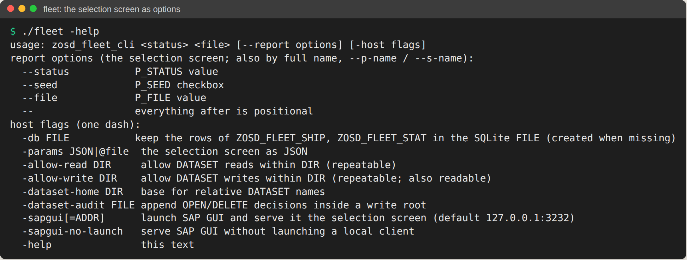
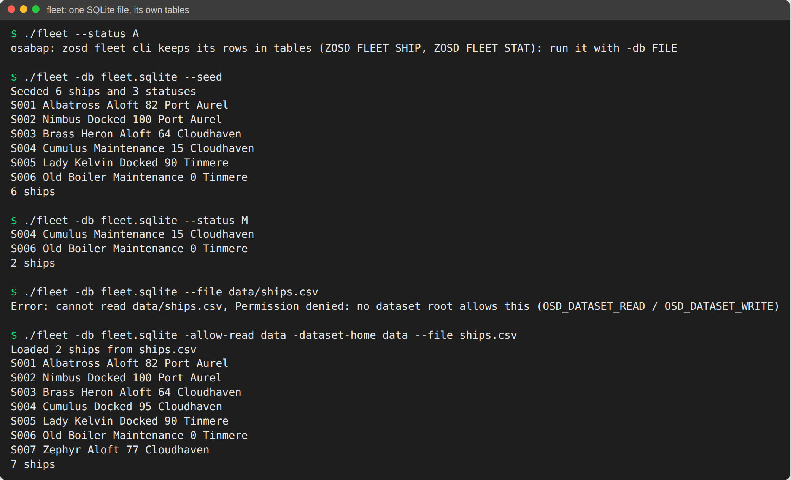
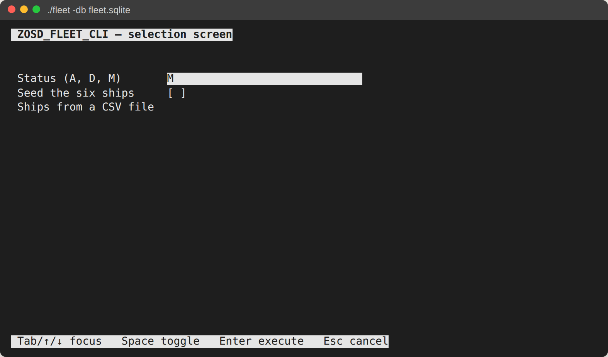
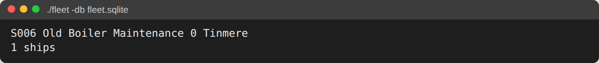

# 14. Мой ABAP сбежал с сервера

До сих пор все работало внутри системы: локальной, в VS Code, но системы, с ее
сервером, базой данных и сеансами. Эта глава выносит из нее один классический
отчет. **osabap** из open-steamgate компилирует исполняемый отчет через
транспайлер ABAP в Go в одну нативную программу: без сервера, без среды
выполнения, которую надо ставить, один файл, который можно скопировать на
другую машину.

## Во что превращается отчет

```text
zosd_fleet_cli.prog.abap
  -> the report converter (a class with the report's lifecycle)
  -> gogen (typed IR, then Go for the report and its small runtime closure)
  -> go build
  -> fleet: one native executable (Linux, macOS, Windows; cross-compiled)
```

Экран выбора остается интерфейсом программы, в трех видах:

- **командная строка**: каждый `PARAMETERS` и `SELECT-OPTIONS` становится
  опцией, `--status M`, `--seed`, `--file ships.csv`; список (`WRITE`) идет в
  stdout, сообщения - в stderr, код выхода 0, 1 (`MESSAGE` любого типа, кроме
  `I` и `S`, либо ошибка выполнения) или 2 (неподдерживаемая операция);
- **форма в терминале** (TUI): запущенная без аргументов в терминале,
  программа показывает экран выбора как форму;
- **SAP GUI**: `-sapgui` отдает тот же экран выбора настоящему SAP GUI по DIAG
  на локальной машине.

Два дефиса - опции отчета (`--status`), один дефис - флаги хоста (`-db`,
`-allow-read`, `-help`), так что опция отчета никогда не столкнется с флагом,
который хост получит позже.

Отчет этой главы, [ZOSD_FLEET_CLI](../../cli/fleet/zosd_fleet_cli.prog.abap),
лежит в `cli/`, а не в паке: это отдельная программа. Его таблицы - таблицы
флота `ZOSD_FLEET_SHIP` и `ZOSD_FLEET_STAT`. osabap компилирует только таблицы,
лежащие рядом с отчетом, поэтому в `cli/fleet` лежат копии их определений из
`src/ddic`; проверка падает, если копии разошлись.

## Сборка

В checkout open-steamgate с Go 1.26 в PATH и библиотеками на своих версиях
(`npm run bootstrap`):

```sh
OSD_HOME=/path/to/open-steamgate node test/cli.mjs --keep /tmp/fleet-cli
```

Скрипт запускает на отчете `node tools/gogen/osabap.mjs` из open-steamgate,
копирует результат в `/tmp/fleet-cli/run/fleet` и прогоняет как проверки шаги
ниже и еще несколько. С `GOOS`/`GOARCH` другой платформы
(например, `GOOS=windows GOARCH=arm64`) он только собирает и оставляет там
`run/fleet.exe`, чтобы скопировать его на ту машину. В VS Code F8 на отчете
(`osd run`) собирает и запускает его так же.

## Запуск

1. `./fleet -help`. Ожидается: экран выбора в виде опций, затем флаги хоста.

   

2. `./fleet --status A`. Ожидается: отказ с кодом выхода 1, `keeps its rows in
   tables (ZOSD_FLEET_SHIP, ZOSD_FLEET_STAT): run it with -db FILE`. Отчет с
   таблицами никогда не получает молча базу в памяти.
3. `./fleet -db fleet.sqlite --seed`. Ожидается: `Seeded 6 ships and 3
   statuses` и шесть кораблей. Файл SQLite создается с таблицами отчета;
   повторный `--seed` говорит `Already 6 ships, nothing seeded`.
4. `./fleet -db fleet.sqlite --status M`. Ожидается: `S004 Cumulus` и
   `S006 Old Boiler`, `2 ships`.
5. `./fleet -db fleet.sqlite --file data/ships.csv`. Ожидается:
   `Error: cannot read data/ships.csv, Permission denied: no dataset root
   allows this (...)` в stderr и код выхода 1. `OPEN DATASET` работает в песочнице:
   без разрешения отказывается любой файл.
6. `./fleet -db fleet.sqlite -allow-read data -dataset-home data --file ships.csv`.
   Ожидается: `Loaded 2 ships from ships.csv`; `S004 Cumulus` теперь `Docked`,
   и появился седьмой корабль, `S007 Zephyr`.

   

Импорт - все или ничего. Строка, в которой пар не число,
`S008,Gauge,A,plenty,Tinmere`, дает `Error: ship S008, steam plenty is not a
number; nothing loaded`, и ни один корабль из файла не сохраняется. Отчет
откатывает изменения и завершается через `MESSAGE ... TYPE 'E'`. В системе это
завершает программу с сообщением в строке состояния, а в фоновом задании
отменяет его; нативная программа пишет
строки, выведенные до него, в stdout, сообщение - в stderr и выходит с кодом
1, так что скрипт это видит.

## Та же программа в виде формы

Запустите ее в терминале без опций отчета: `./fleet -db fleet.sqlite`. Tab и
стрелки переходят между полями, Space переключает флажок, Enter запускает, Esc
отменяет. Введите `M` в поле статуса и нажмите Enter:





В обслуживании теперь только `S006 Old Boiler`: шаг 6 поставил `S004 Cumulus`
в док.

Без терминала (канал, CI) программа спрашивает поля построчно, так что тот же
бинарник работает в скриптах. Подписи полей - тексты экрана выбора отчета,
прочитанные из `zosd_fleet_cli.prog.xml` при сборке, те же, что показывает
`-help`.

## Родственник: экраны в CICS

Экран выбора и dynpro - изобретения SAP, но у их устройства есть близкий
родственник в IBM CICS, мониторе транзакций эпохи терминалов 3270.
Руководство IBM по CICS описывает псевдодиалоговую обработку: программа CICS
отправляет экран и завершает задачу (BMS - интерфейс CICS, который строит
такие экраны по заранее описанным картам), а ввод пользователя запускает
новую задачу, которая подхватывает переданное ей состояние. Цепочка коротких задач выглядит для
пользователя как один разговор, и пока программа ждет ввода, транзакции не
существует. Шаги диалога SAP устроены похоже: шаг диалога - это PAI экрана,
на который ответил пользователь, и затем PBO следующего экрана, а пока экран
ждет ввода, рабочий процесс не занят. Наша программа - простейший случай:
один экран и один ответ за запуск.

Руководство описывает и то, как дать существующим программам 3270 новое
представление, не меняя их, например веб-интерфейс, который сам играет роль
терминала для неизменной программы. WEBGUI в SAP - похожая идея: те же
экраны в виде HTML в браузере (глава 2); форма в терминале и `-sapgui`
здесь - еще два способа показать один экран выбора.

Источник: IBM Redbooks, *Architect's Guide to IBM CICS on System z*:
псевдодиалоговая обработка в главе 1 (с. 11); слой представления, 3270, BMS
и состояние в 3.3 (с. 58–60); модернизация слоя представления 3270 в 4.6
(с. 104–106).

## Что она умеет и чего нет

Отчет собирается и проверяется на `main` open-steamgate, после 0.4:
`MESSAGE`, завершающему запуск, нужен #362, текстам экрана выбора в подписях -
#363. Начиная с #364 и #369, компилируются и запятая в шаблоне цепочки
`WRITE:`, и `CATCH ... INTO` глобальной переменной.

- **Open SQL только на собственных таблицах отчета**, в файле, который
  называет `-db`; каждый запуск - один LUW, `COMMIT WORK` и `ROLLBACK WORK`
  работают. В 0.4 из восемнадцати измеренных форм операторов компилировались
  двенадцать: агрегат в скаляр, кроме `COUNT(*)`, `UP TO ... ORDER BY`,
  `APPENDING TABLE`, сортированная целевая таблица, цикл `SELECT` с
  `GROUP BY` и встроенные `@DATA( )` - нет, и одна такая форма делала
  недоступным весь метод. `main` компилирует все восемнадцать; этот отчет держится
  простого `SELECT ... INTO TABLE` в стандартные таблицы.
- **Файлы** через `OPEN`/`READ`/`TRANSFER DATASET` и `CL_GUI_FRONTEND_SERVICES`,
  внутри корней, которые разрешают `-allow-read` / `-allow-write`.
- **Классы** рядом с отчетом или из папок `--lib`; классы open-abap-core,
  которые он называет, подтягиваются сами.
- **Один экран выбора и один запуск** на процесс; справки F4, всплывающих окон
  и интерактивных списков (`AT LINE-SELECTION`) пока нет; HTTP, OData и ICF
  нет.
- **Как в системе**: в шаблоне `CP` символ `#` - экранирующий, поэтому
  строка, начинающаяся с `#`, это `CP '##*'`, а не `CP '#*'`. **Не как в
  системе**: экран выбора переводит `--status m` в верхний регистр, а
  командная строка нет, поэтому отчет делает это сам через `TRANSLATE`.

Спецификация - в
[docs/osabap-native.md](https://github.com/oisee/open-steamgate/blob/main/docs/osabap-native.md)
open-steamgate.

## Под капотом

Вся логика программы - это `START-OF-SELECTION` отчета:

<!-- code: cli/fleet/zosd_fleet_cli.prog.abap lines 28-61 -->
```abap
START-OF-SELECTION.
* a selection screen on a system upper-cases P_STATUS; the command line does not
  TRANSLATE p_status TO UPPER CASE.
  IF p_seed = abap_true.
    SELECT COUNT(*) FROM zosd_fleet_ship INTO gv_count.
    IF gv_count = 0.
      PERFORM seed.
      WRITE: / 'Seeded 6 ships and 3 statuses'.
    ELSE.
      WRITE: / 'Already', gv_count, 'ships, nothing seeded'.
    ENDIF.
  ENDIF.

  IF p_file IS NOT INITIAL.
    PERFORM load.
  ENDIF.

  IF p_status IS INITIAL.
    SELECT * FROM zosd_fleet_ship INTO TABLE gt_ships.
  ELSE.
    SELECT * FROM zosd_fleet_ship INTO TABLE gt_ships WHERE status = p_status.
  ENDIF.
  SELECT * FROM zosd_fleet_stat INTO TABLE gt_stats.
  SORT gt_ships BY ship_id.
  LOOP AT gt_ships INTO gs_ship.
    CLEAR gv_text.
    READ TABLE gt_stats INTO gs_stat WITH KEY status = gs_ship-status.
    IF sy-subrc = 0.
      gv_text = gs_stat-text.
    ENDIF.
    WRITE: / gs_ship-ship_id, gs_ship-name, gv_text, gs_ship-steam_pct, gs_ship-home_port.
  ENDLOOP.
  gv_count = lines( gt_ships ).
  WRITE: / gv_count, 'ships'.
```

И импорт CSV: обычные операторы `DATASET`, один LUW, откат на первой плохой строке:

<!-- code: cli/fleet/zosd_fleet_cli.prog.abap lines 100-152 -->
```abap
FORM load.
  DATA lv_subrc TYPE i.
  OPEN DATASET p_file FOR INPUT IN TEXT MODE ENCODING UTF-8 MESSAGE gv_msg.
  IF sy-subrc <> 0.
    gv_out = |Error: cannot read { p_file }, { gv_msg }|.
    MESSAGE gv_out TYPE 'E'.
  ENDIF.
  DO.
    CLEAR gv_line.
    READ DATASET p_file INTO gv_line.
    lv_subrc = sy-subrc.
* 4 is the end of the file; GV_LINE is cleared first, so a last line without a
* line feed is taken whether it comes with 0 or with 4
    IF lv_subrc > 4.
      EXIT.
    ENDIF.
    IF lv_subrc = 4 AND gv_line IS INITIAL.
      EXIT.
    ENDIF.
    IF gv_line IS NOT INITIAL AND gv_line NP '##*'.
      CLEAR gs_ship.
      gs_ship-mandt = sy-mandt.
      SPLIT gv_line AT ',' INTO gs_ship-ship_id gs_ship-name gs_ship-status gv_steam gs_ship-home_port.
      TRY.
          gs_ship-steam_pct = gv_steam.
        CATCH cx_sy_conversion_error.
          CLOSE DATASET p_file.
          ROLLBACK WORK.
          gv_out = |Error: ship { gs_ship-ship_id }, steam { gv_steam } is not a number; nothing loaded|.
          MESSAGE gv_out TYPE 'E'.
      ENDTRY.
      MODIFY zosd_fleet_ship FROM gs_ship.
      IF sy-subrc <> 0.
        CLOSE DATASET p_file.
        ROLLBACK WORK.
        gv_out = |Error: ship { gs_ship-ship_id } could not be written; nothing loaded|.
        MESSAGE gv_out TYPE 'E'.
      ENDIF.
      gv_loaded = gv_loaded + 1.
    ENDIF.
    IF lv_subrc <> 0.
      EXIT.
    ENDIF.
  ENDDO.
  CLOSE DATASET p_file.
  IF lv_subrc > 4.
    ROLLBACK WORK.
    gv_out = |Error: cannot read { p_file } to its end; nothing loaded|.
    MESSAGE gv_out TYPE 'E'.
  ENDIF.
  COMMIT WORK.
  WRITE: / 'Loaded', gv_loaded, 'ships from', p_file.
ENDFORM.
```
