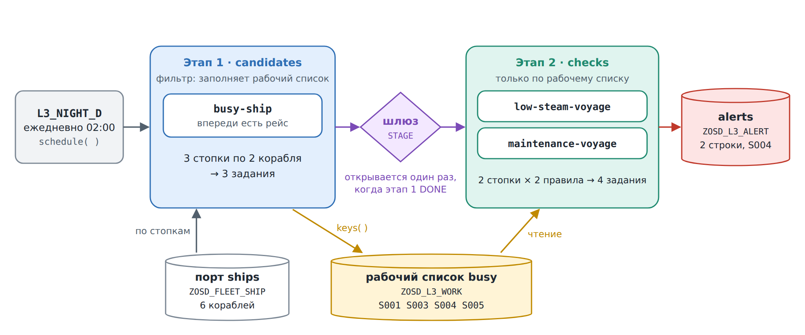
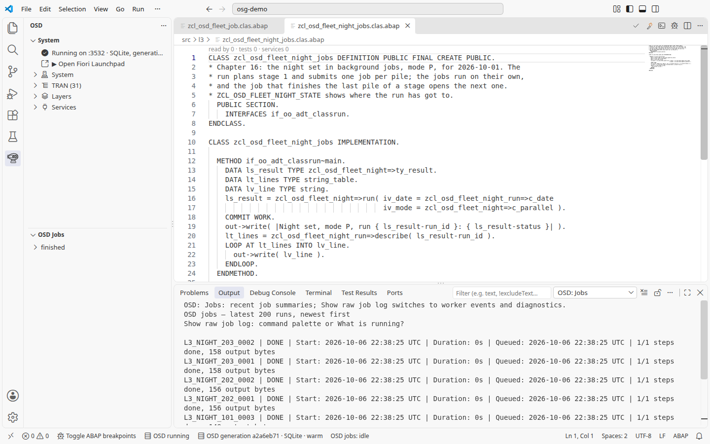
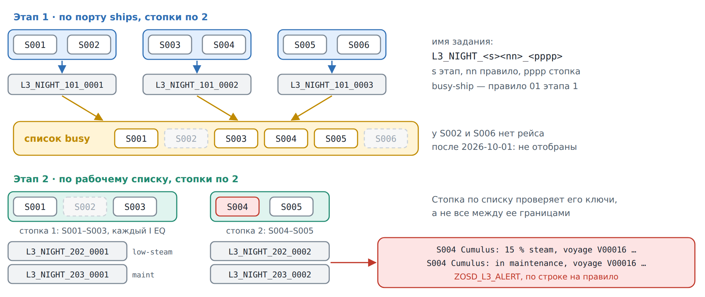
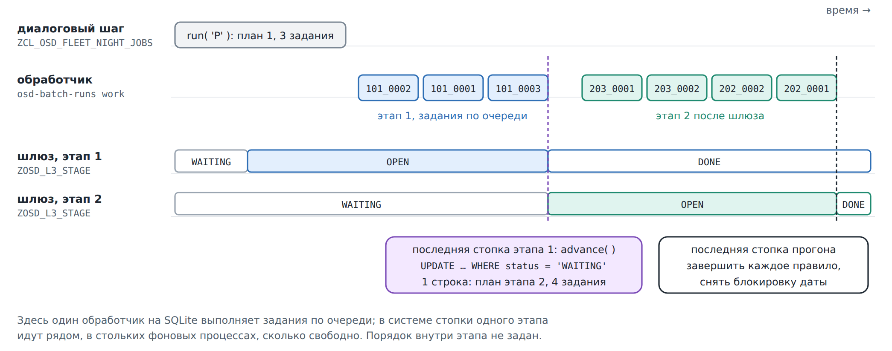
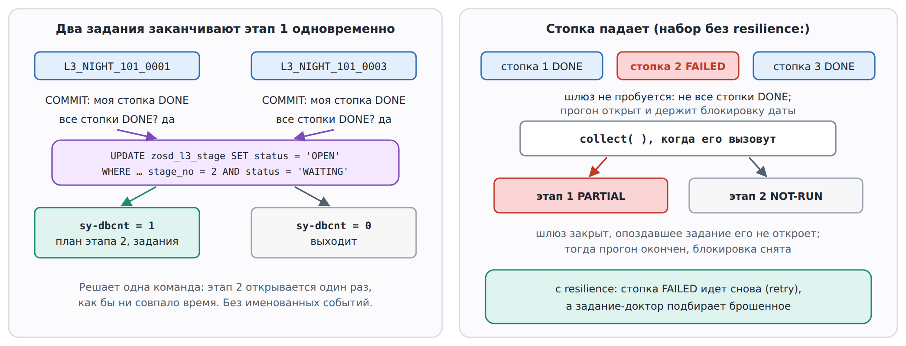

# 16. Оркестрация: ночной набор

В главе 9 два фоновых задания связывались вручную: одно поднимало именованное
событие, другое его ждало, а «доктор» объяснял цепочку, которая не двигалась.
В главе 12 одно правило было записано в YAML, а ABAP написал компилятор. Эта
глава делает то и другое сразу. **Набор** правил описан в одном файле YAML
(DSL L3 open-steamgate) и становится классом-исполнителем и отчетом для
заданий. Они делят работу на задания, выполняют их по этапам, открывают
следующий этап ровно один раз и запускают весь набор каждую ночь.

Ночной набор делает две вещи. Сначала он отбирает корабли, у которых впереди
есть рейс. Затем только по ним выполняет более глубокие проверки, по два
корабля на задание.



## Набор

[fleet_night.l3.yaml](../../src/l3/fleet_night.l3.yaml):

<!-- code: src/l3/fleet_night.l3.yaml lines 7-24 -->
```yaml
set: night
title: The fleet at night, busy ships first, then the deep checks
date: $date
class: zcl_osd_fleet_night
report: zosd_fleet_night
stages:
  - stage: candidates
    filter: true
    worklist: busy
    piles: {source: ships, size: 2}
    rules:
      - rule: busy_ship.l2.yaml
  - stage: checks
    piles: {source: "worklist:busy", size: 2}
    rules:
      - rule: low_steam_voyage.l2.yaml
      - rule: maintenance_voyage.l2.yaml
schedule: {every: 1d, at: "020000"}
```

- `stages` (этапы) выполняются по порядку. Этап n + 1 начинается, только когда
  каждая стопка этапа n в состоянии `DONE`.
- `filter: true` делает этап фильтром. Его правила не выдают сообщений, а
  возвращают ключи, и ключи попадают в рабочий список `busy`, таблицу
  `ZOSD_L3_WORK`.
- `piles` (стопки) делят работу. Этап 1 читает ключи через порт `ships` и
  режет их на стопки по два корабля; этап 2 делает то же по рабочему списку. В
  фоновом режиме каждая пара из правила и стопки становится одним заданием.
- `schedule` делает набор периодическим заданием: каждый день в 02:00
  системного времени.

Остальная часть файла объявляет порты: `ships` читает `ZOSD_FLEET_SHIP` по
`SHIP_ID`, а `alerts` пишет журнал сообщений `ZOSD_L3_ALERT`.

Фильтр — это правило L2, как в главе 12, с двумя добавлениями,
[busy_ship.l2.yaml](../../src/l3/busy_ship.l2.yaml):

<!-- code: src/l3/busy_ship.l2.yaml lines 5-14 -->
```yaml
rule: busy-ship
class: zcl_osd_fleet_l3_busy
title: A ship has a voyage departing after the check date
for: ZOSD_FLEET_SHIP as ship
range: ship.ship_id
keys: true
forbid:
  exists: ZOSD_FLEET_VOY as voy
  where: voy.ship_id = ship.ship_id and voy.dep_date > $date
alert: "{ship.ship_id} {ship.name}: voyage {voy.voyage_id} departs {voy.dep_date}"
```

`range: ship.ship_id` позволяет стопке ограничить правило своими кораблями.
`keys: true` создает метод `keys( )`, который возвращает каждый отобранный
корабль один раз. У двух проверок этапа 2 тот же `range`:
[low_steam_voyage.l2.yaml](../../src/l3/low_steam_voyage.l2.yaml) отмечает
корабль, у которого меньше 30 % пара и впереди рейс, а
[maintenance_voyage.l2.yaml](../../src/l3/maintenance_voyage.l2.yaml) — это
правило главы 12 с `range`, под своим именем и классом.

## Сборка

В checkout open-steamgate сначала три правила, затем набор:

```
for r in busy_ship low_steam_voyage maintenance_voyage; do
  node tools/dsl-l2.mjs build /path/to/osg-demo/src/l3/$r.l2.yaml \
    --out /path/to/osg-demo/src/l3 \
    --ddic /path/to/osg-demo/src/ddic --ddic .local/lars/open-abap-core/src
done
node tools/dsl-l3.mjs build /path/to/osg-demo/src/l3/fleet_night.l3.yaml \
  --out /path/to/osg-demo/src/l3 \
  --ddic /path/to/osg-demo/src/ddic --ddic src/dsl --ddic .local/lars/open-abap-core/src
```

В `src/dsl` лежат общие таблицы L3 open-steamgate, одни на все наборы:
рабочий список, шлюз, план, журнал сообщений и блокировка прогона
(`ZOSD_L3_RUN`). Компилятор пишет исполнитель `ZCL_OSD_FLEET_NIGHT`, отчет
для заданий `ZOSD_FLEET_NIGHT` и классы портов `ZCL_L3_NIGHT_*`; они лежат в
[src/l3](../../src/l3). Рядом четыре небольших classrun показывают, что делает
исполнитель. Они остаются в песочнице: zip приложения B не берет `src/l3`,
потому что системе сначала понадобились бы эти общие таблицы.

## Сначала в одном шаге

Откройте [ZCL_OSD_FLEET_NIGHT_RUN](../../src/l3/zcl_osd_fleet_night_run.clas.abap)
и нажмите **F9**. Он вызывает `run( )` на дату проверки 2026-10-01 в режиме S,
в этом диалоговом шаге и без задания, и затем печатает, что лежит в таблицах
набора:

```
Night set, mode S, run 909F6A50966C4439A82BB78C4C27D105: DONE
Stage 1 candidates: DONE
  busy-ship pile 1 S001-S002: DONE, 1 keys
  busy-ship pile 2 S003-S004: DONE, 2 keys
  busy-ship pile 3 S005-S006: DONE, 1 keys
Stage 2 checks: DONE
  low-steam-voyage pile 1 S001-S003: DONE, 0 alerts
  low-steam-voyage pile 2 S004-S005: DONE, 1 alerts
  maintenance-voyage pile 1 S001-S003: DONE, 0 alerts
  maintenance-voyage pile 2 S004-S005: DONE, 1 alerts
Worklist busy: S001 S003 S004 S005
Alert low-steam-voyage: S004 Cumulus: 15 % steam, voyage V00016 departs 20261012
Alert maintenance-voyage: S004 Cumulus: in maintenance, voyage V00016 departs 20261012
2 alerts
```

ID прогона каждый раз другой. У `S002 Nimbus` и `S006 Old Boiler` нет рейсов
после 2026-10-01, поэтому фильтр их не берет, и проверки на них не смотрят.
`S004 Cumulus` на обслуживании, у него 15 % пара и рейс 12-го числа, поэтому
обе проверки его отмечают.

## В заданиях

Режим P — тот же набор в фоновых заданиях. Как в главе 9, для этого нужен
SQLite в файле. В VS Code **osd: Start** по умолчанию использует файловый
SQLite и следит за обработчиком (`osd.jobs.worker=auto`); задания выполняются
без терминала.

Щелкните **OSD jobs**, чтобы открыть представление **OSD Jobs**. Для читаемой
сводки в канале вывода щелкните **OSD running**, чтобы открыть **OSD: What is running?**, и выберите **Job worker**. У каждого задания стопки своя строка;
**Show raw job log** переключает вывод **OSD: Jobs** на JSON обработчика.



Чтобы увидеть очередь, как ниже, запустите OSD из checkout с `STG_DB=file`,
`STG_DB_PATH` и `OSD_PACKS` и выполняйте обработчик сами.

1. Нажмите **F9** на
   [ZCL_OSD_FLEET_NIGHT_JOBS](../../src/l3/zcl_osd_fleet_night_jobs.clas.abap).
   Он вызывает `run( )` в режиме P, который открывает этап 1, планирует его и
   ставит по заданию на каждую стопку. Пока ничего не выполняется:

   ```
   Night set, mode P, run 552BCB76652E4D35A493106C67ED4742: SUBMITTED
   Stage 1 candidates: OPEN
     busy-ship pile 1 S001-S002: PLANNED, 0 keys in job L3_NIGHT_101_0001
     busy-ship pile 2 S003-S004: PLANNED, 0 keys in job L3_NIGHT_101_0002
     busy-ship pile 3 S005-S006: PLANNED, 0 keys in job L3_NIGHT_101_0003
   Stage 2 checks: WAITING
   Worklist busy:
   0 alerts
   ```

   Если он отвечает `BUSY`, прогон в заданиях на эту дату еще открыт:
   выполняйте обработчик, пока очередь не опустеет, и нажмите F9 снова. Если
   стопка того прогона упала, он остается открытым до `collect( )` (см. ниже).

2. Запустите обработчик (worker), как в главе 9: в checkout, с теми же
   `STG_DB` и `STG_DB_PATH`, но без `OSD_PACKS`, выполняйте
   `node tools/osd-batch-runs.mjs work`, пока он не ответит
   `"kind": "empty"`, или оставьте работать `worker` (Ctrl+C его
   останавливает). Обработчик выполняет семь заданий. Сначала три задания этапа 1, в любом порядке. Последнее из
   них открывает этап 2 и ставит еще четыре, `L3_NIGHT_202_*` и
   `L3_NIGHT_203_*`, и обработчик выполняет и их.
3. Нажмите **F9** на
   [ZCL_OSD_FLEET_NIGHT_STATE](../../src/l3/zcl_osd_fleet_night_state.clas.abap).
   Он находит последний прогон в заданиях на эту дату и печатает его. Каждая
   стопка в `DONE` и называет свое задание, а рабочий список и два сообщения
   те же, что в режиме S:

   ```
   Stage 2 checks: DONE
     low-steam-voyage pile 1 S001-S003: DONE, 0 alerts in job L3_NIGHT_202_0001
     low-steam-voyage pile 2 S004-S005: DONE, 1 alerts in job L3_NIGHT_202_0002
     maintenance-voyage pile 1 S001-S003: DONE, 0 alerts in job L3_NIGHT_203_0001
     maintenance-voyage pile 2 S004-S005: DONE, 1 alerts in job L3_NIGHT_203_0002
   ```

   Нажимайте его между двумя вызовами `work`, чтобы видеть, как движутся
   шлюзы.

## Стопки и имена заданий



Имя задания говорит, чья это стопка: `L3_NIGHT_<s><nn>_<pppp>` — этап `s`,
правило `nn` (нумерация сквозная по набору) и стопка `pppp`. Так,
`L3_NIGHT_203_0002` — этап 2, правило 3 (`maintenance-voyage`), стопка 2.

Стопка этапа 2 — это ключи рабочего списка между ее границами, каждый как
`I EQ`. Стопка 1 показывает `S001-S003`, но проверяет только `S001` и `S003`:
`S002` лежит между границами, но его нет в рабочем списке, поэтому его не
проверяют. Простой `BT` по границам проверил бы ключи, которые фильтр
отбросил.

## Шлюз

Никто не ждет события. Каждое задание стопки ставит своей стопке `DONE`,
делает COMMIT и вызывает `advance( )` для своего этапа. `advance( )` считает
стопки этапа не в `DONE`; пока такая есть, он выходит. Задание, которое не
находит ни одной, ставит своему этапу `DONE` и открывает следующий одной
командой:

<!-- code: src/l3/zcl_osd_fleet_night.clas.abap lines 478-484 -->
```abap
UPDATE zosd_l3_stage SET status = 'OPEN' opened = lv_stamp
  WHERE set_name = c_set AND run_id = iv_run
    AND stage_no = lv_stage
    AND status = 'WAITING'.
IF sy-dbcnt <> 1.
  RETURN.
ENDIF.
```



Только задание, чей `UPDATE` изменил строку, планирует этап 2 и ставит его
задания. Задание, которое заканчивает последний этап, отмечает каждое правило
как завершенное и снимает блокировку даты, поэтому прогон в заданиях
завершает себя сам. Никому не нужно его опрашивать, и прогон следующей ночи
не будет заблокирован.

## Когда два задания заканчивают вместе и когда стопка падает



Эти случаи в главе не выполняются. Так сгенерированный исполнитель
описан в [документации DSL L3](https://github.com/oisee/open-steamgate/blob/vscode-v0.6.1650/docs/dsl-l3.md)
open-steamgate (раздел «The worklist and the gate»), и их проверяют ее
собственные тесты.

- Два задания могут закончить этап 1 в один момент, оба видят все стопки в
  `DONE`, и оба отправляют `UPDATE`. Одно получает `sy-dbcnt = 1` и идет
  дальше, другое получает 0 и выходит. Этап 2 открывается один раз.
- Стопка, чье задание упало, не в `DONE`, поэтому шлюз никто не пробует, а
  прогон остается открытым и держит блокировку своей даты. Кто-то должен
  вызвать метод исполнителя `collect( )`; сам ночной набор этого не делает.
  `collect( )` читает задание каждой открытой стопки через `SHOW_JOBSTATE`;
  если задание закончилось, а его стопка не в `DONE` и все еще за ним, стопка
  становится `FAILED`. Когда остальные стопки этапа завершены, он ставит
  этапу `PARTIAL`, а каждому следующему этапу `NOT-RUN`. Это закрывает шлюз,
  и опоздавшее задание уже не может его открыть. Тогда прогон завершен,
  блокировка снята.
- Повторное или опоздавшее задание возвращает `NOT-PLANNED` для стопки,
  которую уже взяли или завершили. Задание прогона, который больше не держит
  блокировку даты, возвращает `STALE-RUN`. Эти проверки действуют и для
  ночного набора без `resilience:`.

Набор может также объявить `resilience:`: упавшая стопка повторяется после
паузы, доктор-демон по умолчанию подбирает то, что оставило умершее задание, а
предохранители могут остановить прогон. Ночной набор этим не пользуется,
чтобы оставаться маленьким; это описано в разделе «Resilience» документации.

## Каждую ночь

[ZCL_OSD_FLEET_NIGHT_SCHEDULE](../../src/l3/zcl_osd_fleet_night_schedule.clas.abap)
включает и выключает расписание. Нажмите **F9** один раз:

```
Scheduled L3_NIGHT_D 11001000; again: 11001000
Waiting: '11001000'
```

Номер задания каждый раз другой.

`schedule( )` открывает задание-драйвер `L3_NIGHT_D` и деблокирует его на
02:00 системного времени с периодом в один день. Classrun вызывает его
дважды; второй вызов находит ждущий экземпляр и ничего больше не планирует.
Каждую ночь драйвер вызывает `run( )` на этот день в режиме P, а дальше идут
задания, описанные выше.

Нажмите **F9** еще раз, чтобы выключить:

```
Unscheduled L3_NIGHT_D 11001000: 1 deleted, 0 refused
Waiting: ''
```

`unschedule( )` возвращает отдельные числа `deleted` и `refused`; здесь
удаляет ждущий экземпляр, и цепочка заканчивается.
`node tools/osd-batch-runs.mjs work` после этого отвечает `"kind": "empty"`:
от набора ничего не осталось к выполнению (если очередь пуста, как после
шага 2).

## Сравнение с главой 9

| | Цепочка главы 9 | Ночной набор |
|---|---|---|
| Записано как | ABAP: `JOB_OPEN`, `SUBMIT VIA JOB`, `JOB_CLOSE` с событием | YAML; ABAP генерируется |
| Порядок | второе задание ждет именованного события | строка шлюза на этап, открывается одним `UPDATE` |
| Параллельная работа | одно задание на шаг | одно задание на правило и стопку |
| Шаг падает | ждущее задание остается в `WAITING`; доктор объясняет | прогон открыт, пока `collect( )` не поставит этапу `PARTIAL`, остальным `NOT-RUN` |
| Каждую ночь | не показано | периодическое задание-драйвер, по времени: `schedule( )`, `unschedule( )` |

Шлюзы набора принадлежат ему: они открывают только его следующий этап.
Ничто вне набора не может ждать их так, как ждут именованного события. На
SQLite один обработчик выполняет задания одно за другим. В системе стопки
одного этапа идут рядом, в стольких фоновых рабочих процессах, сколько
свободно, а порядок заданий внутри этапа не задан ни там, ни здесь. Режим P
здесь выполнялся только на SQLite с одним обработчиком, не в системе.

`node test/l3.mjs` (приложение A) прогоняет шаги этой главы на настоящем
движке: режим S, режим P с обработчиком, состояние и включение и выключение
расписания. Двух случаев с картинки шлюза и запуска драйвера в 02:00 он не
выполняет: он проверяет, что драйвер ждет и удаляется.
