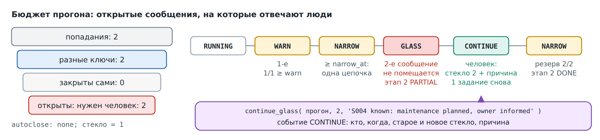

# 17. Регулятор: бюджет для людей

Ночной набор из главы 16 проверяет каждый занятый корабль и пишет сообщение
на каждую найденную проблему. Эти сообщения кто-то должен прочитать. В плохую
ночь проверка может написать их тысячи, а ответить на тысячи некому.
**Регулятор** (governor) дает прогону бюджет: сколько открытых сообщений
выдержат люди, которые за ним стоят. Когда бюджет исчерпан, прогон
останавливается, и продолжить его может только человек — с причиной, которая
остается в истории прогона.

В этой главе ночной набор работает под регулятором с самым маленьким бюджетом,
какой бывает: одно открытое сообщение. Поэтому оба сообщения флота о
`S004 Cumulus` пройти не могут.

## Набор

[fleet_watch.l3.yaml](../../src/l3/fleet_watch.l3.yaml) — это ночной набор
под новым именем `watch`: те же этапы, правила и порты, без расписания и с
тремя новыми блоками:

<!-- code: src/l3/fleet_watch.l3.yaml lines 47-55 -->
```yaml
resilience:
  retry: {max: 2, backoff: 60}
  stale: 900
  keep: {days: 30}
governor:
  budget: {glass: 1, counts: open, warn: 0.7, narrow_at: 0.8, per_pile: 0}
  funnel: {group_by: object, autoclose: port:close}
settings:
  tunable: [budget.glass]
```

- `resilience` — основа, на которой стоит регулятор: упавшую стопку можно
  отправить снова, а `doctor( )` подбирает то, что оставило упавшее задание.
  По умолчанию доктор приходит сам: прогон в режиме P запускает демон,
  даже без расписания.
- `glass` («стекло») — бюджет, число открытых сообщений, которое может быть у
  прогона. Имя от «разбить стекло»: дальше должен действовать человек.
- `warn` и `narrow_at` — доли стекла. На `warn` прогон один раз отмечает это,
  на `narrow_at` сужается: новое задание не отправляется, пока идет другая
  стопка прогона. Уже отправленные задания выполняются.
- `per_pile: 0` выключает отдельный предел на стопку.
- `funnel` решает, что считать. Сообщение считается один раз на правило,
  прогон и корабль (`group_by: object`): два попадания одного правила по
  одному кораблю — это одно сообщение. Порт `close` может закрывать сообщения
  сам, например для кораблей, чей случай уже известен; закрытые сообщения
  возвращают свое место в бюджете. Здесь он привязан к `none`, который ничего
  не закрывает.
- `settings` делает `budget.glass` значением, которое можно менять без новой
  сборки. Новое значение действует на следующие прогоны, никогда на уже
  начатый.

Собирается так же, как ночной набор (глава 16), через
`tools/dsl-l3.mjs build`. Компилятор пишет исполнитель `ZCL_OSD_FLEET_WATCH`,
его отчет для заданий `ZOSD_FLEET_WATCH`, порты `ZCL_L3_WATCH_*` и класс
настроек `ZCL_L3_WATCH_CONF` с его отчетом `ZL3_WATCH_CONF`. Бюджет лежит в
общей таблице open-steamgate `ZOSD_L3_BUDGET`, история прогона — в
`ZOSD_L3_EVENT`.

Он также пишет `ZCL_L3_WATCH_DMN`, подкласс `CL_ABAP_DAEMON_EXT_BASE`,
и отчет-диспетчер `ZL3_WATCH_DOC`. Таймер (по умолчанию десять секунд)
или сообщение о завершении стопки заставляет демон поставить проход доктора
заданием. Сам callback не выполняет восстановление прогона. У стекла демон
остается жив, но проходов не ставит; когда ни один прогон не держит блокировку,
он останавливается сам. Classrun состояния печатает `Doctor: RUNNING since …`
или `Doctor: STOPPED since …` с данными прохода и таймера. Это локальные
наблюдения, а не проверка на настоящей системе.
<!-- shot: состояние watch у стекла с Doctor RUNNING, затем итог с Doctor STOPPED -->



## Прогон останавливается у стекла

Запустите OSD с базой в файле, как в главе 16.

1. Нажмите **F9** на
   [ZCL_OSD_FLEET_WATCH_JOBS](../../src/l3/zcl_osd_fleet_watch_jobs.clas.abap).
   Он запускает набор в заданиях на 2026-10-01 и печатает
   `Watch set, mode P, run <ID>: SUBMITTED`.
2. Выполняйте обработчик, пока очередь не опустеет, как в главе 16, или
   дайте обработчику расширения выполнить их. Заданий стопок семь, плюс
   задания-диспетчеры доктора; число проходов зависит от таймера и сообщений.
3. Нажмите **F9** на
   [ZCL_OSD_FLEET_WATCH_STATE](../../src/l3/zcl_osd_fleet_watch_state.clas.abap).
   Он печатает последний прогон набора на эту дату. Временные метки доктора
   и число восстановлений зависят от прогона, поэтому показаны заполнителями:

   ```
   Watch set, run B2179C23A3CF434380CA033254965E8D
   Doctor: RUNNING since <started> last <last_pass> healed <n> next <next_tick>
   Lock on 20261001: HELD
   Stage 1 candidates: DONE
     busy-ship pile 1: DONE
     busy-ship pile 2: DONE
     busy-ship pile 3: DONE
   Stage 2 checks: PARTIAL
     low-steam-voyage pile 1: DONE
     low-steam-voyage pile 2: GLASS (GLASS)
     maintenance-voyage pile 1: DONE
     maintenance-voyage pile 2: DONE
   Budget: GLASS, glass 1, reserved 1, consumed 1, refunded 0
   Event 1 WARN: glass 1, reserved 1
   Event 2 NARROW: glass 1, reserved 1
   Event 3 GLASS: glass 1, reserved 1, amount 1, "reservation does not fit"
   Event 4 GLASS-STAGE: glass 1, reserved 1, amount 2
   Alert maintenance-voyage: S004 Cumulus: in maintenance, voyage V00016 departs 20261012
   1 alerts
   ```

Задания этапа 2 идут в любом порядке, поэтому в вашем прогоне пройти может
сообщение другого правила. А если обработчик выполнил задание второго
сообщения раньше стопки без сообщений, эта стопка тоже останавливается у
стекла, хотя писать ей нечего.

Читайте снизу вверх, от бюджета:

- Прежде чем стопка запишет свои сообщения, она резервирует по месту на
  каждый новый корабль и правило, все одним условным `UPDATE`. Первое
  сообщение о S004 помещается: `reserved 1` из `glass 1`.
- Пороги проверяются после каждого допуска, как отношение резерва к стеклу.
  При стекле в единицу первое же сообщение проходит и 0,7, и 0,8, поэтому
  сразу приходят `WARN` (пишется один раз за прогон) и `NARROW`.
- Второе сообщение о S004 не помещается. Его стопка ничего не пишет и
  останавливается как `GLASS`, бюджет прогона переходит в `GLASS`, а этап
  останавливается: `GLASS-STAGE` с `amount 2` — номер этапа, который стекло
  перевело из `OPEN` в `PARTIAL`.
- Прогон держит блокировку своей даты (`Lock on 20261001: HELD`). Новая
  стопка не начинается, а `resume( )` и доктор оставляют прогон как есть:
  бюджет сам не пополняется.

## Человек продолжает прогон

[ZCL_OSD_FLEET_WATCH_GLASS](../../src/l3/zcl_osd_fleet_watch_glass.clas.abap)
играет роль человека. Он вызывает

<!-- code: src/l3/zcl_osd_fleet_watch_glass.clas.abap lines 23-25 -->
```abap
lv_ok = zcl_osd_fleet_watch=>continue_glass( iv_run = lv_run
                                             iv_new_glass = ls_budget-glass + 1
                                             iv_reason = c_reason ).
```

с причиной, здесь `S004 known: maintenance planned, owner informed`. Новое
стекло должно быть больше старого, а причина не может быть пустой.

1. Нажмите на нем **F9**. Ожидается:
   `Continue run <ID> with glass 2: X`.
2. Снова выполните обработчик. Он выполнит по заданию на каждую стопку,
   которая остановилась у стекла; здесь одно.
3. Снова нажмите **F9** на `ZCL_OSD_FLEET_WATCH_STATE`. Ожидается, кроме
   строк выше:

   ```
   Doctor: STOPPED since <started> last <last_pass> healed <n> next <next_tick>
   Lock on 20261001: RELEASED
   Stage 2 checks: DONE
     low-steam-voyage pile 2: DONE (STALE-PLAN)
   Budget: NARROW, glass 2, reserved 2, consumed 2, refunded 0
   Event 5 CONTINUE: glass 2, reserved 1, amount 2, "S004 known: maintenance planned, owner informed" by DEVELOPER
   Event 6 NARROW: glass 2, reserved 2
   Alert low-steam-voyage: S004 Cumulus: 15 % steam, voyage V00016 departs 20261012
   Alert maintenance-voyage: S004 Cumulus: in maintenance, voyage V00016 departs 20261012
   2 alerts
   ```

`CONTINUE` записывает, кто разрешил продолжить, когда, новое стекло и
причину; `DEVELOPER` — локальный пользователь OSD. `continue_glass( )` снова
открывает только этапы, которые остановило стекло (`GLASS-STAGE`), снова
планирует остановленную стопку и продолжает прогон. Причина стопки
`STALE-PLAN` говорит, почему ее отправили еще раз, а не чем она кончилась:
она была спланирована, но без задания. Прогон завершается, как в главе 16, и
снимает свою блокировку.

## Три предела

У набора с регулятором три предела, и отвечают они на разные вопросы:

| Предел | Что считает | Когда превышен |
|---|---|---|
| `budget.glass` | открытые сообщения прогона, каждый корабль один раз на правило | `GLASS`: прогон ждет человека |
| `budget.per_pile` | кандидатов в открытые сообщения в одной стопке | стопка `HELD` и ничего не пишет; `release_pile( )` с причиной возвращает ее в `PLANNED`, затем `resume( )` ее выполняет |
| `resilience.fuses.max_alerts` | каждую строку сообщений правила в прогоне | правило `FUSED` и перестает писать |

Набор watch пользуется только стеклом. Два других предела описаны в
[документации DSL L3](https://github.com/oisee/open-steamgate/blob/vscode-v0.6.1621/docs/dsl-l3.md)
open-steamgate (разделы «Governor: the manual-handling budget» и «Fuses») и
здесь не выполняются.

## Чего эта глава не показывает

- Порт автозакрытия, который закрывает сообщения и возвращает их место в
  бюджете. Своего у флота здесь нет; `close: none`.
- Прогон в одном шаге (режим S) под регулятором и гонку двух стопок за
  последнее место в бюджете. Оба выполняют собственные тесты open-steamgate.
- Человека за экраном. Здесь его заменяет classrun; в теге есть
  генерируемый пульт L3, но это демо его не генерирует и не проверяет.

`node test/l3.mjs` (приложение A) выполняет шаги этой главы на настоящем
движке: прогон, который останавливается у стекла (G1), и продолжение, которое
его завершает (G2). Он также проверяет, что демон запускается без расписания,
не меняет стекло за такт таймера и останавливается после завершения.
