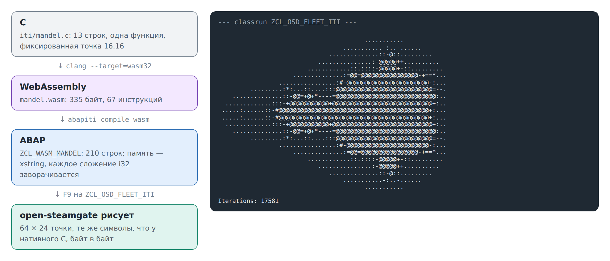

# 18. Потому что можем: C в ABAP

Остальные главы уводят ABAP куда-то: в службу, в браузер, в командную строку.
Эта идет в обратную сторону. Маленькая функция на C становится классом ABAP, и
система флота ее выполняет. Инструмент —
[abapiti](https://github.com/oisee/abapiti), чей README начинается со слов
«because we can», «потому что можем». Он компилирует WebAssembly, LLVM IR и
TypeScript в ABAP и говорит о себе, что это исследовательская игрушка, которая
заодно выдает ABAP, принимаемый настоящей системой SAP.

О флоте в этой главе ничего нет. Она здесь, потому что это весело, и потому
что с необычной стороны показывает, что выполняет локальная ABAP-система и где
она отличается от настоящей.



## C

[iti/mandel.c](../../iti/mandel.c) считает для точки плоскости, за сколько
шагов итерации Мандельброта |z|² превысит 4, в формате с фиксированной точкой
16.16, чтобы обойтись без плавающей:

<!-- code: iti/mandel.c lines 1-13 -->
```c
/* Iterations of z = z*z + c at one point, in 16.16 fixed point, at most max. */
int mandel(int cx, int cy, int max) {
  int x = 0, y = 0, i = 0;
  while (i < max) {
    long long xx = (long long)x * x >> 16, yy = (long long)y * y >> 16;
    if (xx + yy > (4 << 16)) break;
    int xy = (int)((long long)x * y >> 16);
    x = (int)(xx - yy) + cx;
    y = 2 * xy + cy;
    i++;
  }
  return i;
}
```

## В ABAP

[iti/build.sh](../../iti/build.sh) делает это в два шага (а перед ними
собирает abapiti). Запускайте его с `ABAPITI`, указывающим на checkout
abapiti; нужны clang с целью `wasm32`, `wasm-ld` и Go:

```
clang --target=wasm32 -O2 -nostdlib -Wl,--no-entry -Wl,--export=mandel \
  -o iti/mandel.wasm iti/mandel.c
abapiti compile wasm iti/mandel.wasm -o out/
```

clang делает 335 байт WebAssembly: одну функцию из 67 инструкций. abapiti
делает из них класс [ZCL_WASM_MANDEL](../../src/iti/zcl_wasm_mandel.clas.abap)
на 210 строк; он лежит в репозитории. Его открытая часть — по методу на
экспортированную функцию:

```abap
METHODS mandel IMPORTING p0 TYPE i p1 TYPE i p2 TYPE i RETURNING VALUE(rv) TYPE i.
```

Остальное — маленькая машина. WebAssembly — стековая машина, поэтому метод
работает через переменные `s0`, `s1`, …, которые изображают стек, а счетчик
`lv_br` изображает выходы из вложенных блоков. Глава собиралась abapiti
`3e92daf`; класс не предназначен для чтения, и комментариев в нем нет нарочно
(см. ниже).

## Картинка

[ZCL_OSD_FLEET_ITI](../../src/iti/zcl_osd_fleet_iti.clas.abap) спрашивает
класс о каждой точке сетки 64 × 24 и печатает по символу на точку, от пробела
(уходит за пару шагов) до `@` (не уходит никогда). Нажмите на нем **F9**.
Ожидается: картинка выше и строка `Iterations: 17581`, сумма всех счетчиков.

[iti/draw.c](../../iti/draw.c) рисует ту же сетку тем же C, собранным для
вашей машины (`cc -O2 iti/draw.c iti/mandel.c && ./a.out`). Его вывод лежит в
[iti/mandel.expected.txt](../../iti/mandel.expected.txt), а `test/iti.mjs`
(приложение A) проверяет две вещи: что нативный C по-прежнему печатает этот
файл и что classrun в open-steamgate печатает те же 25 строк, байт в байт.

Одна строка classrun — не там, где обычно ищут подвох:

<!-- code: src/iti/zcl_osd_fleet_iti.clas.abap lines 31-31 -->
```abap
lv_cy = -81920 + lv_row * 163840 DIV ( c_rows - 1 ).
```

В C `/` на целых отбрасывает дробь. В ABAP `/` на целых округляет. Чтобы
картинка совпала с C символ в символ, classrun берет `DIV`, который для этих
положительных чисел отбрасывает дробь, как C.

## Что процессор делает даром

Интересно в классе то, что ему приходится расписывать. `i32.add` в WebAssembly
просто заворачивается по модулю 2³²; сложение `TYPE i` в ABAP, вышедшее за
диапазон, бросает исключение. (В C знаковое переполнение вообще не определено;
эта картинка к нему и не подходит.) Поэтому каждое 32-битное сложение в
сгенерированном коде идет через помощника:

<!-- code: src/iti/zcl_wasm_mandel.clas.abap lines 111-120 -->
```abap
METHOD i32_add.
  DATA lv_p TYPE p LENGTH 16 DECIMALS 0.
  lv_p = iv_a.
  lv_p = lv_p + iv_b.
  lv_p = lv_p MOD 4294967296.
  IF lv_p >= 2147483648.
    lv_p = lv_p - 4294967296.
  ENDIF.
  rv = lv_p.
ENDMETHOD.
```

Память WebAssembly — один массив байтов. Здесь это `xstring`, а запись четырех
байтов — `REPLACE SECTION` в байтовом режиме, после того как значение вручную
переставлено в little-endian:

<!-- code: src/iti/zcl_wasm_mandel.clas.abap lines 54-63 -->
```abap
METHOD mem_st_i32.
  DATA lv_le TYPE x LENGTH 4.
  DATA lv_be TYPE x LENGTH 4.
  lv_be = iv_val.
  lv_le+0(1) = lv_be+3(1).
  lv_le+1(1) = lv_be+2(1).
  lv_le+2(1) = lv_be+1(1).
  lv_le+3(1) = lv_be+0(1).
  REPLACE SECTION OFFSET iv_addr LENGTH 4 OF mv_mem WITH lv_le IN BYTE MODE.
ENDMETHOD.
```

Сам `mandel` память не трогает: все его числа живут в переменных. Программы
побольше трогают, и отсюда истории ниже.

## Истории abapiti

Это находки самого abapiti, рассказанные его авторами и измеренные на их
программах на A4H, в JavaScript-рантайме abaplint, на котором стоит
JavaScript-сторона open-steamgate, и в Go-рантайме open-steamgate (osgo). Эта
глава их не повторяла.

- **Цикл, который не кончался.** Переход WebAssembly к метке цикла значит «еще
  круг». Сначала abapiti писал на это `EXIT`. Quicksort зависал на двух
  элементах, и на A4H его фоновое задание шло 565 секунд, пока его не сняли в
  SM37. С тех пор тестовые задания abapiti пишут статусное сообщение на каждом
  шаге, и зависание видно там, где оно случилось. Исправлено в abapiti #11;
  `CONTINUE` ближе к концу `mandel` выше и есть это исправление.
- **Упакованные числа в JavaScript.** В настоящей системе `p LENGTH 16` точен.
  JavaScript-рантайм abaplint держит его как double, который точен только до
  2⁵³: 94906267² mod 2³² вышло на единицу меньше, и тот же quicksort давал
  неверные контрольные суммы. osgo и A4H считали точно. abapiti перенес
  64-битную арифметику на `int8`, точный и в JavaScript; на A4H это вышло
  примерно на 13 % быстрее. (Версия abapiti, на которой стоит глава,
  `3e92daf`, еще использует `p` в `i32_add`; его суммы далеко от 2⁵³. Более
  поздние версии и там берут `int8`.)
- **Заворачивание не бесплатно.** Метод на каждое сложение больше чем
  удваивает время тесного цикла: на A4H в фоновом задании 10 000 шагов
  генератора случайных чисел заняли так 12 мс, а с арифметикой прямо в коде —
  5,3 мс.
- **Без CASTING.** Прочитать четыре байта памяти как `i` через `ASSIGN ...
  CASTING` на A4H — дамп `ASSIGN_BASE_WRONG_ALIGNMENT`. Отсюда перестановка
  байтов выше.
- **255 символов.** ADT не принимает строку исходника длиннее 255 символов,
  поэтому сгенерированный код переносит свои длинные строки. Комментариев в
  нем тоже нет: однажды операторы, упакованные в строку после комментария до
  конца строки, стали частью комментария, и класс не активировался («ENDDO
  without DO»). Метод в 150 000 строк и класс из 150 методов активировались.
- **Память на месте.** `REPLACE SECTION` той же длины меняет `xstring` на
  месте и был примерно вдвое быстрее, чем держать память во внутренней
  таблице. В JavaScript-рантайме abaplint `xstring` — шестнадцатеричная
  строка, поэтому каждая запись ее копирует.
- **Скорость.** Quicksort 500 чисел занял 10,8 мс на A4H как фоновое задание и
  около 1,3 с в JavaScript-рантайме abaplint, примерно в 120 раз медленнее. На
  A4H контрольные суммы совпали с нативными для каждого измеренного размера,
  от 1 до 500.

## Где локальная система отличается

Картинка — маленькая программа: 1536 вызовов, числа далеко от всех границ и
никакой памяти. На локальной системе она выходит такой же, как нативно.
Истории выше показывают, где программа, которая опирается на края ABAP — его
упакованные числа, его переполнение целых, его память, — может вести себя на
локальной системе иначе, чем на настоящей. abapiti держит маленькие ABAP-репро
этих краев, измеренные на настоящей системе, чтобы различия можно было
исправлять в open-steamgate одно за другим.

Сгенерированный класс и classrun остаются в песочнице: zip приложения B не
берет `src/iti`.
