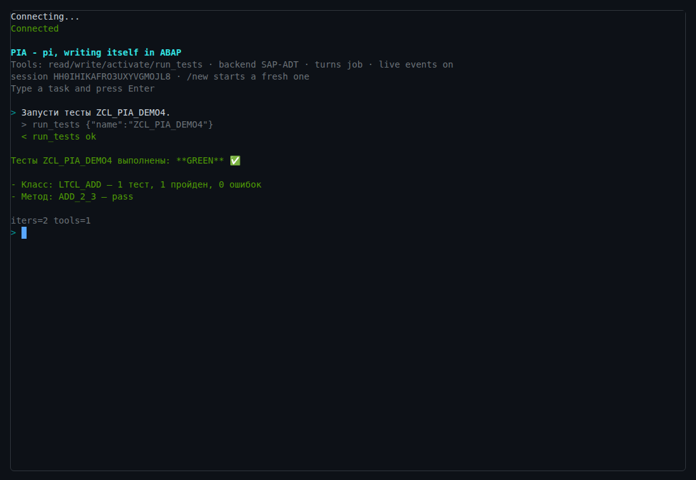
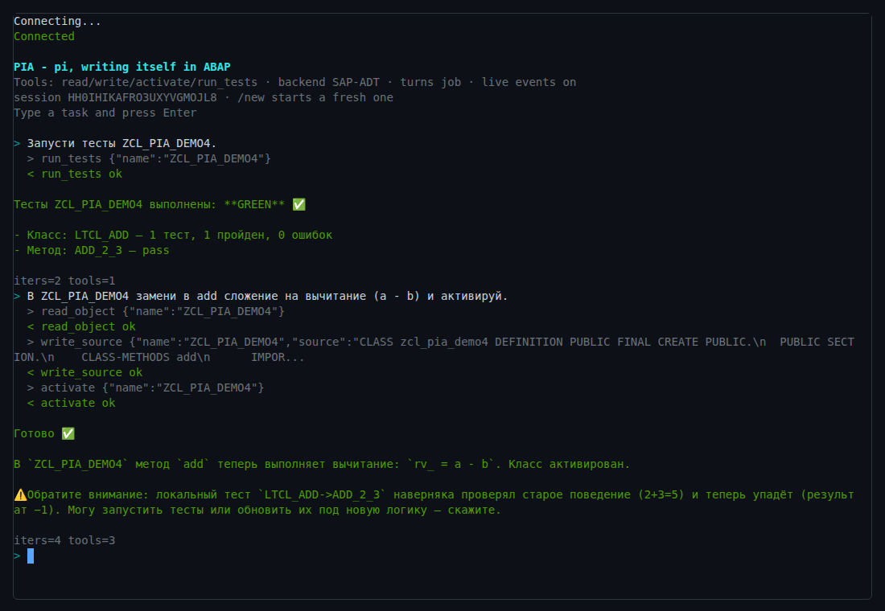
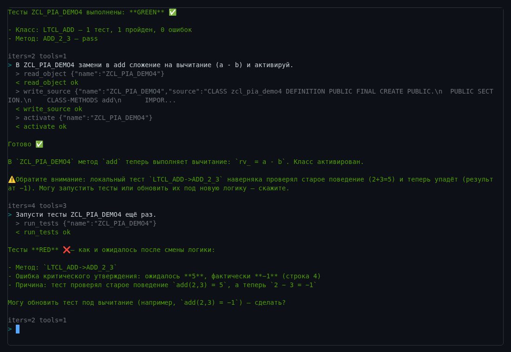
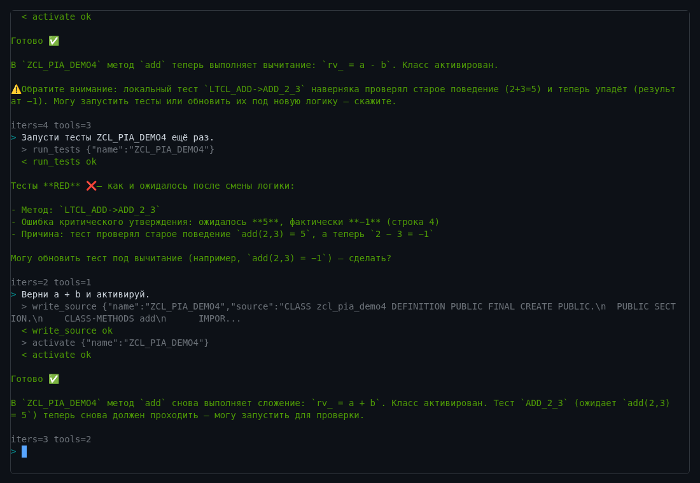
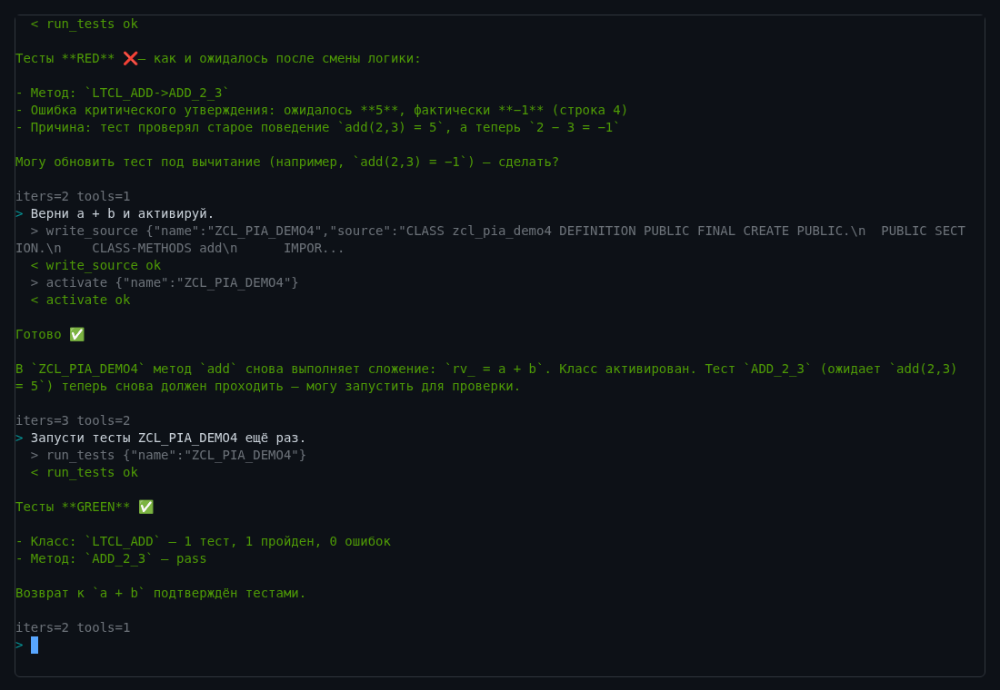
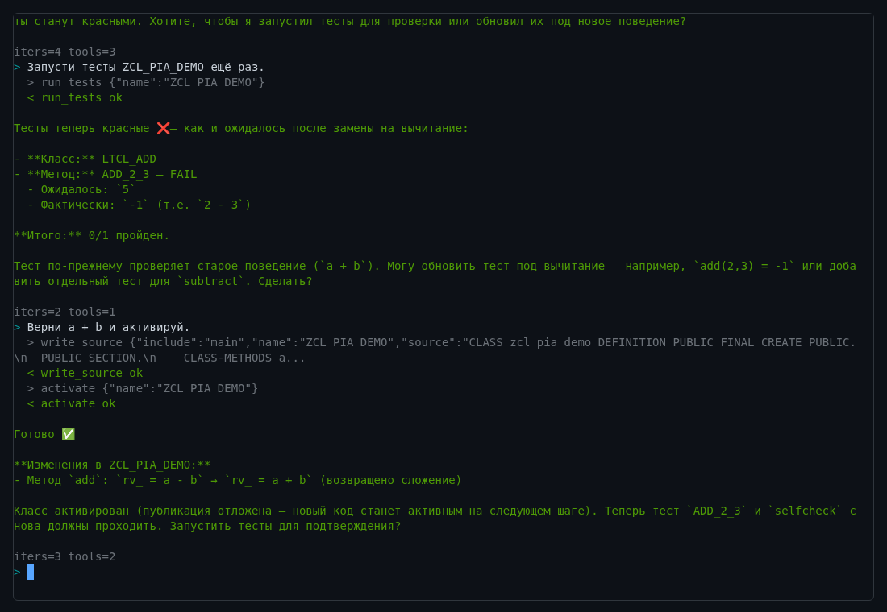
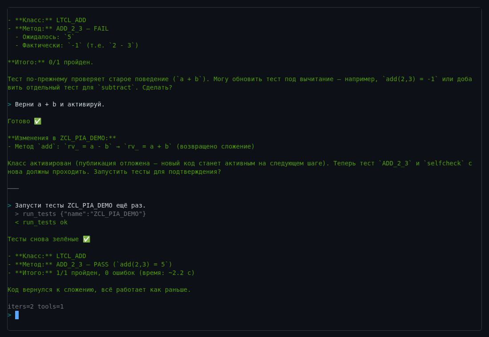

# 19. Агент, который пишет ABAP изнутри системы

В остальных главах за клавиатурой сидит человек: вы нажимаете F9, читаете
консоль, меняете строку. В этой главе клавиатуру получает программа.
[PIA](https://github.com/oisee/pia), Pi-ABAP Agent, — агент для
программирования, написанный на ABAP. Он работает внутри той системы, которую
изменяет. Вы набираете задачу в терминале в браузере, а PIA читает
класс, записывает изменение, активирует его и запускает тесты ABAP Unit — в
той же системе и от вашего имени.

Всё здесь — собственные результаты PIA из его релизов
[v0.1.0](https://github.com/oisee/pia/releases/tag/v0.1.0) и
[v0.1.1](https://github.com/oisee/pia/releases/tag/v0.1.1). Картинки — PIA
0.1.1: пять сняты на ABAP Platform Trial от SAP (A4H, NetWeaver 7.58), две —
на open-steamgate; сами мы эти прогоны не повторяли.
Последний раздел говорит, что нужно, чтобы запустить то же самое в своей
песочнице.

## Ход

PIA даёт языковой модели четыре инструмента и ничего больше:

- `read_object` — исходник класса;
- `write_source` — заменить исходник класса, его основную часть или
  тестовые классы;
- `activate` — активировать класс;
- `run_tests` — запустить его тесты ABAP Unit и вернуть результат.

Ход — это цикл. PIA отправляет модели задачу и описания инструментов.
Модель отвечает либо текстом, и тогда ход заканчивается, либо вызовами
инструментов; PIA выполняет каждый вызов, отправляет результаты обратно, и
модель решает снова. Ход может занять не больше восьми шагов
([zcl_pia_00_executor](https://github.com/oisee/pia/blob/v0.1.0/src/00/zcl_pia_00_executor.clas.abap)).
Инструмент — это класс ABAP за одним небольшим интерфейсом:

```abap
METHODS get_name        RETURNING VALUE(rv_) TYPE string.
METHODS get_description RETURNING VALUE(rv_) TYPE string.
METHODS get_params      RETURNING VALUE(rt_) TYPE tt_params.
METHODS get_permission  RETURNING VALUE(rv_) TYPE string.
METHODS invoke
  IMPORTING iv_arguments TYPE string
            iv_call_id   TYPE string OPTIONAL
  RETURNING VALUE(rs_)   TYPE ts_result.
```

([zif_pia_00_tool](https://github.com/oisee/pia/blob/v0.1.0/src/00/zif_pia_00_tool.intf.abap);
право — `READ`, `WRITE` или `EXECUTE`.) Аргументы приходят в том JSON,
который написала модель; вывод инструмента уходит модели обратно текстом.
Модель в v0.1.0 — `glm-5.3` от z.ai, к ней ABAP обращается по HTTPS.

## Зелёный, красный, зелёный

Релизный тест PIA ведёт терминал через Playwright
([tui-e2e.mjs](https://github.com/oisee/pia/blob/v0.1.1/osg-probe/ui/tui-e2e.mjs))
по пяти задачам на маленьком классе `ZCL_PIA_DEMO4`: его метод `add`
возвращает `a + b`, а единственный тест ждёт, что `add( 2, 3 )` даст 5.
Строка, начинающаяся с `>`, — задача; строки `>` и `<` с отступом под ней —
вызовы инструментов и их результаты, по мере того как они происходят.
Картинки — PIA 0.1.1 на A4H
([screenshots/a4h-tui-011](https://github.com/oisee/pia/tree/68431f8/screenshots/a4h-tui-011)).

Сначала тесты: один вызов, зелёный.



Затем намеренная поломка: «поменяй add на a - b и активируй». Модель читает
класс, записывает его обратно с изменением, активирует и сама добавляет, что
тест теперь упадёт.



Тесты красные: ожидалось 5, получено −1. Результат теста SAP пишет
отрицательное число как `1-`, с минусом в конце, как принято в ABAP, а модель
переводит его обратно в −1.



Исправление: «верни a + b и активируй». Два вызова инструментов.



И пятая задача снова запускает тесты: зелёный.



Тот же прогон проходит на английском, датском и русском: модель отвечает на
языке задачи. По отчёту релиза PIA на A4H проходят все пятнадцать шагов.

## Один агент, две системы

Инструменты не обращаются к системе сами: они обращаются к бэкенду
разработки, и фабрика выбирает его при запуске PIA
([zcl_pia_20_backend](https://github.com/oisee/pia/blob/v0.1.0/src/20/zcl_pia_20_backend.clas.abap)):

```abap
cl_abap_typedescr=>describe_by_name( EXPORTING p_name = 'ZCL_OSD_ADT_HOST'
                                     EXCEPTIONS type_not_found = 1 OTHERS = 2 ).
lv_class = COND #( WHEN sy-subrc = 0 THEN `ZCL_PIA_20_B_OSG_STORE` ELSE `ZCL_PIA_20_B_ADT` ).
```

- На SAP `ZCL_PIA_20_B_ADT` говорит по ADT — тому же REST-интерфейсу, которым
  пользуется среда разработки, — с той системой, в которой работает.
  `cl_http_client=>create_internal` открывает соединение от текущего
  пользователя без пароля. PIA пишет только в уже существующие классы и
  только в локальных пакетах (`$…`).
- На open-steamgate `ZCL_PIA_20_B_OSG_STORE` обращается к рантайму напрямую:
  отслеживаемая активация, которая сообщает, когда новый код опубликован, и
  `RUN_TESTS` на этом опубликованном поколении. README PIA называет около 2,6
  секунды на публикацию правки существующего класса таким путём.

Оба бэкенда возвращают результаты тестов в одной форме JSON, так что
инструменты — и модель — видят один формат.

## Чего не разрешает SAP и чего это стоит

Терминал — это ABAP Push Channel: WebSocket, который обслуживает ABAP.
Естественный замысел — выполнять ход агента прямо в обработчике канала. На
A4H так не вышло: при переносе PIA выяснилось, что внутри обработчика APC
SAP запрещает ABAP Unit и запись исходников, то есть два из четырёх
инструментов PIA. Поэтому на SAP
каждый ход идёт фоновым заданием `PIA_<сессия>`, а задание отправляет
события инструментов обратно в терминал через ABAP Messaging Channels (AMC).
По замерам PIA простой ход занимает около десяти секунд, первое событие
инструмента приходит через 4,5–5,5 секунды
([заметки о переносе](https://github.com/oisee/pia/blob/v0.1.0/osg-probe/a4h/README.md)).
На open-steamgate PIA выполняет ход прямо в обработчике канала
(`PIA_TURN_MODE=inline`).

## Истории PIA

Это собственные находки PIA из его отчётов и заметок о переносе.

- **Кто может отправлять.** Канал AMC перечисляет программы, которым
  разрешено в него отправлять. Проверяется программа, которая вызывает
  `send`, а не та, что начала работу. Класс-слушатель PIA несёт об этом
  комментарий, а определение канала называет каждый отправляющий класс
  ([zpia_amc.samc.xml](https://github.com/oisee/pia/blob/v0.1.0/src/00/zpia_amc.samc.xml)).
  Так и на SAP, и в open-steamgate.
- **Пробел в заголовке.** Первый живой вызов модели упал с «Auth Failed»:
  заголовок авторизации потерял пробел в `Bearer <ключ>`. Это показал дамп
  исходящего запроса, исправил строковый шаблон.
- **`VALUE` — не присваивание.** `DATA lv_depth TYPE i VALUE 1` внутри цикла
  задаёт значение один раз, при входе в метод, а не на каждом проходе:
  объявления в ABAP не исполняемые операторы. Разборщик JSON в PIA
  рассчитывал на обратное и выдавал пятнадцать лишних `{`. Помогли явные
  присваивания и `CLEAR`. Это правило ABAP, и читатель с опытом JavaScript
  легко на нём спотыкается.
- **`\u003e`.** Модель присылает исходник в JSON, а JSON может записать `>`
  как `\u003e`. Пока декодер не научился `\u`, `=>` попадало в класс как
  `=u003e` — и сломанный класс всё равно активировался. Сторону
  open-steamgate («сломанный исходник активируется молча») отчёт PIA
  записывает в находки для open-steamgate.
- **Что пропустил open-steamgate.** Перенос на SAP нашёл код, который
  open-steamgate принимал, а SAP нет:
  - `DATA x TYPE i VALUE <переменная>`;
  - `strlen` и `to_upper` над `xstring`;
  - строки исходника длиннее 255 символов.

  На SAP ничто из этого не компилируется.
- **PIA правит PIA.** Получив задачу «добавь метод VERSION в
  ZCL_PIA_00_JSON_UTIL», PIA прочитал один из своих классов, добавил метод
  и записал его. Собственный `activate` сообщил об ошибке, которой не было,
  поэтому класс активировали снаружи; после перезапуска метод ответил
  `v0.2-selfhosted`
  ([отчёт](https://github.com/oisee/pia/blob/v0.1.0/reports/2026-10-06-SELF-HOSTING.md)).
  Агент на ABAP, написанный на ABAP, изменил свой собственный ABAP.

## Тот же прогон на open-steamgate

[PIA 0.1.1](https://github.com/oisee/pia/releases/tag/v0.1.1) проходит те же
пять ходов на open-steamgate. Эти картинки сняты там, при воспроизведении
записанных ответов модели, о котором ниже
([screenshots/osg-tui](https://github.com/oisee/pia/tree/68431f8/screenshots/osg-tui)).
Одно отличие видно в ответах агента: на open-steamgate активация публикуется в
конце хода, поэтому модель пишет «публикация отложена — новый код станет
активным на следующем шаге», и тесты идут следующим ходом.





## Запуск в своём open-steamgate

PIA 0.1.1 умеет воспроизводить главу без ключа модели. Строка
`PIA_LLM=record:<файл>` в `pia-settings.env` (настройки без секретов, рядом с
`pia.env`) записывает каждый ответ модели в файл, а `PIA_LLM=replay:<файл>`
отвечает из него по порядку, без ключа и без сети. Инструменты при этом
выполняются по-настоящему. В релизе лежит `pia-chapter.rec`: сценарий из пяти
ходов на английском, датском и русском, записанный на open-steamgate. Чтобы
начать заново, удалите `pia-chapter.rec.pos`
([заметки к релизу](https://github.com/oisee/pia/releases/tag/v0.1.1)).

На том релизе open-steamgate, для которого написана книга, это пока не
работает. Заметки к релизу PIA называют, что терминалу ещё нужно в
open-steamgate и чего пока нет в релизе:
- расширения каналов AMC;
- публикация в конце шага APC;
- рецикл рантайма, который не обрывает соединение посреди хода.

Когда это войдёт в релиз open-steamgate, этот раздел проведёт вас по пяти
ходам в вашей песочнице.

<!-- hands-on: after the OSG release with AMC channel extensions, publish at the end of an APC step and the quiet-recycle fix -->

На SAP PIA ставится уже сейчас: zip для abapGit, два сертификата для хоста
модели, файл с ключом и терминал по адресу `/sap/bc/zpia_tui/`. Шаги — в
[README](https://github.com/oisee/pia/blob/v0.1.1/README.md).
